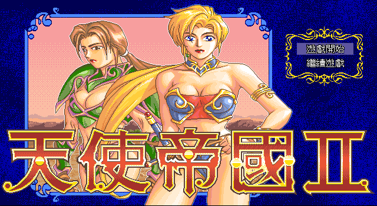
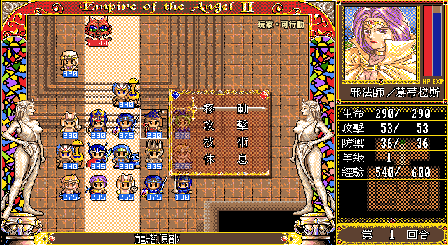
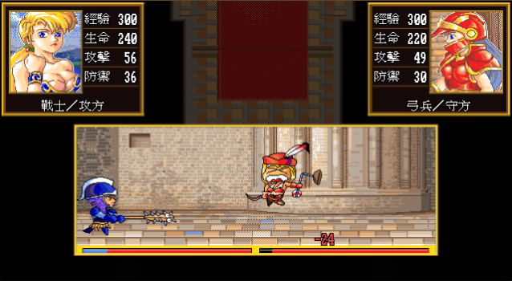
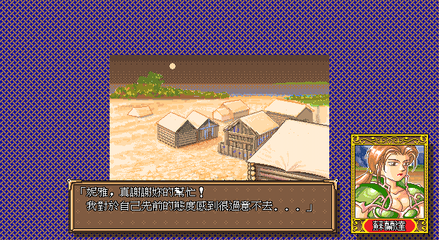

# 《天使帝国 II》Web 复刻

[](https://github.com/WispSnow/angel2-web-remake/actions/workflows/ci.yml)
[](LICENSE)
[](https://phaser.io/)
[](https://www.typescriptlang.org/)

用逆向取证驱动的方式，把 1994 年大宇资讯的 DOS 战棋游戏《天使帝国 II》（Empire of the
Angel II）完整复刻到浏览器：原版规则、剧情节奏、像素素材、音乐音效与 UI 构图逐项从原版
可执行文件和资源文件取证还原，而不是凭记忆重做。

**▶ 在线试玩：<https://angel2-web-remake.pages.dev/>**（无需安装，桌面浏览器直接打开）

<table>
  <tr>
    <td></td>
    <td></td>
  </tr>
  <tr>
    <td></td>
    <td></td>
  </tr>
</table>

> **原版素材版权声明**
>
> 《天使帝国 II》的美术、音乐、音效、文本与角色版权归大宇资讯（Softstar Entertainment
> Inc.）及其权利继承者所有。**本仓库不分发原版素材**——克隆后需要另行安装素材包，见
> [获取原版素材](#获取原版素材)。素材及仓库内由原版数据生成的内容表都是原始资源的衍生
> 数据，仅用于兼容性研究、游戏考古与数字保存，**不属于本项目的 MIT 授权范围**，也不授权
> 任何商业使用。本项目与大宇资讯没有任何隶属或授权关系。若权利人提出异议，将立即移除相关
> 内容。详见[授权与版权](#授权与版权)。

---

## English summary

A browser reimplementation of *Empire of the Angel II* (天使帝國 II, Softstar, 1994), a
DOS tactical RPG. Every rule, dialogue beat, sprite, sound and UI layout is reconstructed
from evidence extracted out of the original executable and data files — the repository
keeps the disassembly notes, the machine-readable evidence register and the design
contracts alongside the code, so any gameplay behaviour can be traced back to a specific
original-game offset rather than to someone's memory.

* **Play it now:** <https://angel2-web-remake.pages.dev/> (desktop browsers, no install)
* **Stack:** TypeScript, Phaser 4, Vite, Vitest, Playwright. No backend — saves live in
  `localStorage`.
* **Scope:** all 38 campaign stages (第 0–37 關), the interlude, the main ending and the
  credits roll are playable end to end, plus 39 unit classes and the original technique
  set. Every stage but the last has passed manual playtest acceptance; the final stage has
  cleared its automated and visual gates and is awaiting that playtest.
* **Architecture:** the deterministic simulation (grid, damage, experience, AI, PRNG,
  save state) has no dependency on Phaser or the DOM; the scene layer only projects
  simulation state into sprites and feeds semantic input back.
* **Run it:** `pnpm install && pnpm dev`, then open <http://127.0.0.1:4173/>.
* **Licence:** project code and documentation are MIT. The converted original-game assets
  under `public/assets/original/` are **not** covered by that licence — see the copyright
  notice above.

Documentation is written in Chinese, because the evidence, the original text and the
design contracts all are.

---

## 当前进度

普通入口已按原版顺序接入 **39 个战斗／过场节点**：玩家可见的第 0–37 关，加上第 5 关后的
「異世界之門」过场；另接入主线结局与制作人员表。流程覆盖固定／交互编队、逐关事件与剧情、
玩家与独立友军军团、敌方多军团、全技术行动、失败重试、战中与战后存档、首领／到达／全灭
目标，以及主线结局和隐藏终端。最后一关「異世界」已完成运行时、自动与视觉门禁，仍以普通
入口人工试玩作为最终验收。

> **关卡编号说明**：玩家看到的是第 0–37 关；仓库内部的关卡 ID 为 `stage-00`…`stage-38`，
> 因为原版记录中 `stage-25` 不存在，第 25 关及以后的内部 ID 比玩家编号大 1（例如内部
> `stage-38` 就是玩家看到的「第 37 關 · 異世界」）。过场使用独立 ID `stage-42-portal`。

当前验收状态以 [`planning/STATUS.md`](planning/STATUS.md) 为准；路线与里程碑见
[`planning/ROADMAP.md`](planning/ROADMAP.md)，活跃风险见 [`planning/RISKS.md`](planning/RISKS.md)。
面向玩家的规则差异见 [`docs/player/remake-differences.md`](docs/player/remake-differences.md)。

## 项目特点

**证据驱动，而不是凭印象重做。** 每条规则、每个数值、每句对白都能追溯到原版可执行文件的
具体偏移或资源记录号。`reverse/` 保存反汇编笔记、机器可读规格与核验产物，
`design/remake-gdd/` 定义复刻版的产品决定，两者分开且不互相覆盖。设计标签区分已确认的原版
事实（`[OF]`）、复刻默认规则（`[SR]`）、明确的产品决定（`[DD]`）、待验证假设（`[H]`）和
未闭合项（`[TBD]`），实现者不得自行猜测。

**模拟与表现严格分层。** `src/game/simulation/` 是单位、回合、合法行动、伤害、经验、AI、
胜负和 PRNG 的唯一真值，不依赖 Phaser 或 DOM。动画加速、减少动态、声音开关和跳过演出只
改变等待或表现，不改变结算顺序、随机序列或存档语义。

**确定性可复现。** 所有影响战果的随机数来自版本化、可序列化的模拟 PRNG；眨眼、口型、粒子
等表现随机使用独立随机源。渲染帧率、音频是否播放成功、窗口焦点和资源加载顺序都不影响模拟
结果。

**原版点阵字与像素还原。** 右栏、回合框、命令选单、对白正文、伤害数字等原版复现的表面全部
由从 BIOS 字库与原版字串取证生成的 16×15 点阵字绘制，逐列落点也是取证值。像素素材默认最近
邻缩放，平滑缩放只作为玩家显式选择的显示偏好。

**内容全部由生成脚本固化。** 关卡地图、阵容、事件、对白、职业目录、肖像目录、音乐和图集
都由 `scripts/` 下的生成器从逆向产物写入 `src/game/content/` 与 `public/assets/original/`；
浏览器运行时不读取任何逆向工作目录。

**多个独立验收表面。** 战役调试中心、全地形竞技场、全职业对阵场、转职触发实验室、肖像动画
实验室、战斗动画实验室、地图技能动画实验室和部署验收页各自复用正式模拟与渲染器，可以在不
建立战役、不写存档的前提下逐项检查表现和规则。

## 技术栈

| 项 | 值 |
| --- | --- |
| 运行时 | Phaser 4.2.1、TypeScript 5.9、Vite 8 |
| 单元测试 | Vitest |
| 浏览器验收 | Playwright（版本绑定的 Chromium） |
| 桌面封装 | Tauri 2（Windows NSIS） |
| 部署 | Cloudflare Pages（Direct Upload） |
| 包管理 | pnpm（版本以 `package.json#packageManager` 为准） |
| Node.js | `.node-version` 记录主版本 `26`；`engines` 只声明下限 `>=24.18.0` |

游戏没有后端：存档写入当前网页来源的 `localStorage`，不上传任何数据。

## 获取原版素材

**本仓库不分发原版游戏素材**，需要单独安装素材包，游戏才能运行。原因见
[授权与版权](#授权与版权)。

下载 `angel2-assets-<version>.zip`，解压到 `public/assets/`：

> 📦 **下载地址**：[百度网盘](https://pan.baidu.com/s/16vMJsOtSs7tFE8JYP6jA_A) 提取码: zsuf 


```bash
unzip -d public/assets angel2-assets-<version>.zip
```

解压后目录应当是这样——`original/` 与仓库自带的 `community/`、`labs/` 平级：

```
public/
├── _headers
└── assets/
    ├── community/          # 仓库自带
    ├── labs/               # 仓库自带
    └── original/           # ★ 素材包，约 67 MB
        ├── music/  portraits/  full-combat/  audio/ …
        └── resource-manifest.v1.json
```

随时可以确认是否装对：

```bash
pnpm check:assets                  # 校验清单、路径与文件大小
pnpm check:assets --verify-hashes  # 另外逐个校验 SHA-256
```

`pnpm dev`、`pnpm test` 和 `pnpm build:release` 会在启动前自动跑同一个检查，缺失、放错层级
或版本不匹配时会直接给出路径和安装命令。素材包必须与当前 commit 对应：清单里的身份哈希会与
代码中的 `RESOURCE_MANIFEST_IDENTITY` 比对，用错版本会被拦下。

## 运行

环境要求：Node.js、pnpm。重新生成原版内容还需要 `oggenc`（vorbis-tools）与 ImageMagick 的
`magick` 命令；只运行游戏不需要它们。

```bash
pnpm install
pnpm dev
```

浏览器打开 `http://127.0.0.1:4173/`。各实验室入口（`pnpm dev:arena`、`dev:combat` 等）同样
需要已安装的素材包。

> **注意**：本仓库的开发流程还依赖 `ref/` 与 `reverse/` 下的逆向工作产物，这些目录同样被
> gitignore 且不随仓库分发，也不包含在素材包里。装好素材包后可以正常游玩、构建和跑大部分
> 测试，但内容生成脚本、`pnpm docs:check` 的部分检查和依赖逆向证据的单元测试需要这些产物
> 才能运行。

### 操作

推荐先用鼠标体验：左键选择／确认，右键循环对焦下一名尚未行动的我方单位，指针停留在战场
边框或底部地点 banner 可滚动镜头。也支持键盘与标准手柄。

| 动作 | 键盘 | 说明 |
| --- | --- | --- |
| 移动光标 | 方向键／`W` `A` `S` `D` | `Home`／`PageUp`／`End`／`PageDown` 为斜向 |
| 确认 | `Enter`／`Space` | `Ctrl`／`Insert` 作为原版相容键保留 |
| 取消／返回 | `Esc`／`Backspace` | `Alt`／`Delete` 作为原版相容键保留；无可取消对象时 `Esc` 打开系统菜单 |
| 下一名未行动单位 | `Tab` | |
| 集体命令 | `G` | |
| 胜利条件 | `O` | |
| 全部休息／跟随主将／自由行动／全面撤退 | `F1`–`F4` | |
| 音效设置（四项开关＋音量） | `E` | |
| 音乐音量（五档） | `M` | |
| 魔弓箭道左右切换 | `Q`／`E` | 仅在指定箭道时有效 |

### 战场流程

1. 选择尚未行动的我方单位；
2. 从职业行动菜单选择「移動」，再在原版网点范围内选择合法格；
3. 移动后选择「攻擊／結束／返悔」，或在初始菜单直接「攻擊／休息」；
4. 所有手动单位提交后进入我方自动与敌方阶段；也可用「全部休息」一次提交剩余单位；
5. 各关胜利条件不同——第 0 关清除全部敌人，第 1、2、3 关分别需击败娜米、萊莉、梅蒂，
   其余关卡有首领、到达区域、保护目标或全灭等组合；当前关的实际条件始终显示在右栏，
   也可用 `O` 或系统菜单的「勝利條件」查看。

没有单位焦点时，右栏显示战术桌与实时小地图；悬浮或选中单位时改为单位详情。单位上框、
小地图边饰、数值分隔和回合栏由原版 `A/0006` 素材及坐标生成，身份区只显示居中的职业／名字；
玩家控制／行动摘要、友军或敌军战术及力场提示仅在点击单位后显示于底部字幕栏。`Esc` 根菜单
提供原文五项「遊戲功能／勝利條件／讀取記錄／儲存記錄／離開遊戲」；表现速度与地图／全景战斗
位于「遊戲功能」子菜单，「音效設定」进入「說話／移動／戰鬥／按鍵」四项独立开关，「音樂」
进入「無聲／1／2／3／最大」五档单选。表现与声音选项不会改变模拟状态或随机数序列。

战术桌沿用原版 12 个物件坐标：鼠标短暂停留后会在桌面下方显示原文功能提示，移开即消失；
键盘用户仍可从 `Esc` 菜单及上表快捷键完成同一组功能。热点获得键盘焦点时会显示轮廓和相同
提示，但正常画面不会常驻按钮框。

## 存档与继续游戏

战中「儲存記錄」和胜利后的保存提示共用 20 个浏览器本地手动槽，并按每页 5 槽显示；标题、
战中菜单和战后保存均可用左右方向或页码按钮翻页。重新载入网页后，可从标题的「繼續遊戲」
选择有效槽。

存档使用当前网页来源的 `localStorage`，同一浏览器配置与相同协议、主机、端口下刷新或重启
浏览器仍会保留，但不会跨浏览器、设备、`localhost/127.0.0.1` 或不同端口同步。清除站点数据
或结束隐私浏览会删除存档。当前没有自动存档或云同步；只有玩家明确选择存档槽时才写入进度。
标题会拒绝空槽、损坏数据和不兼容的存档版本。标题及战中储存／读取面板均可导出／导入版本化
的 20 槽 JSON 备份，用于在 Web 与桌面版之间迁移。

战中档会同时保存「当前战况」和不可变的「入关快照」。读档仍从保存时的当前回合继续；之后若
战败或确认全面撤退，则从入关快照重新开始本关，本次尝试取得的经验、升级、转职、生命变化和
随机进度都不会保留。正常胜利仍把最终成长带入下一关。存档格式的历史版本由冻结的迁移链逐版
升级；更早的、没有历史快照的战中档在迁移时会把旧档当前状态一次性作为重试基线。存档 schema
与迁移链见 [`src/game/save/`](src/game/save)。

## 发布构建

`pnpm build` 生成开发构建到 `dist/`，包含调试中心和各类实验室入口。面向玩家的发布构建使用
独立模式：

```bash
pnpm build:release
pnpm preview:release
```

发布构建输出到 `release/`，只包含主游戏入口和其运行时资源，不生成 `debug.html`、实验室页面或
调试场景动态模块；技能实验室的落雷帧与实验音频也不会进入发布目录，但战役地图实际使用的职业
棋子会保留。`release/` 是可重复生成的编译产物，不应手工编辑；正式部署时上传该目录的内容。
当前线上站点使用 Cloudflare Pages Direct Upload；项目名、授权边界、完整发布、线上验证与回滚
步骤见 [`docs/release-and-deployment.md`](docs/release-and-deployment.md)。

Windows 本地版复用同一个玩家 `release/`，再由 Tauri 2 封装为 NSIS 安装包。正式 Windows 包
不在 Mac 本地交叉编译；`Windows desktop package` 工作流使用真正的 `windows-latest` runner
构建，并把安装程序保存为 Actions artifact。该工作流只允许手动触发或 `desktop-v*` 标签触发，
不会部署 Cloudflare：

```bash
pnpm desktop:dev             # 本机 Tauri 调试，需要本机 Rust 工具链
pnpm desktop:build           # 构建当前操作系统的桌面包
pnpm desktop:build:windows   # 仅供 Windows runner 生成 NSIS 安装包
```

当前 Windows 开发包使用系统 Evergreen WebView2；缺失时安装程序静默调用联网引导程序。桌面版
使用稳定 Tauri 应用标识保存自己的 `localStorage`，不会自动读取网页来源下的存档；玩家可通过
现有 20 槽备份导出／导入在 Web 与桌面版之间迁移。桌面窗口中的「銳利」与「平滑」会按客户区
宽高等比放大 640×350 逻辑画面，拖动窗口或切换全屏都会立即重新适配；「整數倍」会退出最大化／
全屏，并把外部窗口调整到当前显示器可容纳、最接近现有大小的完整装置像素倍数。Web 版继续保留
原有最多 1 倍和整数倍留边规则。完整触发、下载、签名和验收边界仍见
[`docs/release-and-deployment.md`](docs/release-and-deployment.md)。

## 开发与验收表面

除了普通 `/` 入口，仓库提供多个独立页面用于逐项验证规则和表现。它们全部复用正式模拟与
渲染器，只存在于当前页面内存，不读写战役存档。

### 战役调试中心

需要直接选择关卡、部署、玩家回合或结算状态时运行：

```bash
pnpm dev:debug
```

也可以在开发服务器已经运行时打开 `http://127.0.0.1:4173/debug.html`。调试中心目前提供
已接入运行时节点的关前剧情、部署／固定准备、玩家回合、技能／事件夹具、一击胜利和
直接通关入口，并可选择四档难度。选择「逐关代表性成长」或「深层转职分支覆盖」时，还可在
页面顶部输入固定「每关成长」并点击「套用设定值」；第 N 关按 `N × 每关成长` 建立成长预算，
默认值明确为每关 `100`，所以第 1 关预算为 100、第 5 关为 500；「恢复预设（每关 100）」
会回到这组数值。普通角色先确定性随机进入二阶职业；预算跨过当前职业转职阈值时扣除阈值、
随机选择合法下一职，并把余额继续投入新职业。因此第 5 关界面显示的是最终职业余额，而不是
直接写入整段成长预算。相同 URL 的随机路径可复现，且不修改正式记录。场景内工具栏不提供经验
改值或重启功能。

调试场景由 `src/game/debug-scenarios.ts` 的注册表统一管理；新增关卡必须至少登记关前、
部署／准备、玩家回合、胜利准备和完成路由等适用入口。调试会话只修改当前内存，不自动
写入正式存档；普通 `/` 不加载该模块，也不暴露 `window.__ANGEL2_DEBUG__`。自动测试使用的
`window.__ANGEL2__` 仍只在 `?test=1` 下存在，两者不得用于普通通关验收。

### 全地形竞技场

需要自由组合当前已接入的敌我职业并直接验证正式战斗规则时运行：

```bash
pnpm dev:arena
```

也可以打开 `http://127.0.0.1:4173/arena.html`。竞技场使用第 1 关原版地图中完整的
22×25 区域，集中覆盖沙地、平地、森林、山地、桥、石路、墙与河流。设置页可选择敌我
阵营、当前已发布的 35 种常规地图职业和 1–3 级，在符合该职业移动规则的格子上放置、替换或
删除单位；每方最多 24 人。开战后复用正式模拟、AI、职业行动、HUD 和全景战斗表现。

竞技场只维护当前页面内存，不读取或写入战役存档；战斗中的系统菜单只保留设置与胜利
条件。可用顶部工具栏按相同阵容重开，或返回设置继续调整。职业出现在清单中只表示地图
素材和基础数值已经接入；尚未实现的职业专属行动不会因竞技场而自动开放。

### 全职业对阵场

需要一次部署全部常规职业并逐组测试同职业敌我对战时运行：

```bash
pnpm dev:classes
```

也可以打开 `http://127.0.0.1:4173/class-showdown.html`。页面按原版记录 `0–34` 依次建立
35 组同职业配对，每组我方与敌方相邻；18 组纵向排在左列，17 组排在右列。战场统一使用
平原规则，不混入全地形竞技场的地形变量。选择第 1–3 级资料后，必须点击「一键设置全部
兵种等级」才会把该资料列同时应用到 70 名单位；开战后复用正式模拟、职业行动、敌方 AI、
地图／全景表现和 HUD。

女帝、龍、頭、手是 `special_runtime` 记录，不属于本页的常规职业同兵种对测；其中龍、頭、
手没有原版我方地图图形，因此页面不会伪造。对阵会话与战役存档完全隔离，并可按相同等级
重开或返回编成修改统一等级。

### 转职触发实验室

需要集中检查全部普通转职来源、触发点与候选 UI 时运行：

```bash
pnpm dev:promotions
```

也可以打开 `http://127.0.0.1:4173/promotion-lab.html`。页面按原版记录顺序建立 12 组、
24 名敌我相邻单位，经验统一设为各职业进入第 4 成长行前 1 点。我方取得经验会进入正式
授职对话与强制候选菜单；敌方使用相同的第三行后 `+100` 成长门槛，但只升级、不转职。
本页复用正式模拟、Phaser 战场和 DOM UI，并与战役存档完全隔离。

### 肖像动画实验室

所有原版角色的眨眼、说话口型和覆盖片落点可以从独立页面集中检查：

```bash
pnpm dev:portraits
```

也可以打开 `http://127.0.0.1:4173/portrait-lab.html`。实验室默认显示第 0–1 关角色，
可切换为 `D/0..67` 全目录，并可强制查看半闭、闭眼、闭嘴、小幅张嘴和完整口部素材。
正式运行时与实验室共用 `portrait-catalog.generated.ts`；新关卡只需引用原版肖像记录号，
不再为新角色手工登记动画。`D/63` 因原版没有动画元数据和覆盖帧而明确保持静态，
`D/67` 按原版行为沿用 `D/56` 布局。

### 战斗动画实验室

全景战斗表现可以从独立页面直接测试，不需要进入关卡、移动单位或触发真实结算：

```bash
pnpm dev:combat
```

也可以在已经运行 `pnpm dev` 时打开 `http://127.0.0.1:4173/combat-lab.html`。实验室与正式
游戏共用 `buildFullCombatScript` 和同一个 DOM 渲染入口；它只构造表现输入，不修改战役、
存档、模拟或 PRNG。

页面可以指定攻方／守方职业与双方生命、`≤10` 格挡或 `>10` 重伤、守方是否死亡、左右攻击方向、
播放速度、循环和音效。生命默认取所选职业在实验室经验值下的原生上限，也可在 `1–839` 内任意
输入，以检查 `209/210`、`419/420`、`629/630` 等生命条分层边界；切换职业会载入该职业的默认
生命。时间轴支持暂停、40 ms 单步与按原生语义节点跳转；「格擋／重傷／死亡」按钮只切换当前
职业组合的表现结果，不再硬编码职业。配置会同步到网址参数，便于复制和复现同一场景。

女帝、龍、頭、手只有右侧可重放。女帝没有独立的原版普通全景战斗图形：左侧资源为空，唯一可
重放的右侧资料逐字节复用士兵画面。龍（场景 20／22）、頭与两只手（场景 37）在原版只以 side 2
出战，因此没有左侧表现块，也没有对应的 `M_00` 图形。选择这些职业时，实验室会自动锁定方向并
显示这一原版边界——当攻方时锁右、当守方时锁左；这不是素材加载失败。

### 地图技能动画实验室

地图技能可以在独立 Phaser 场景中逐帧检查，不需要建立战役或真实结算：

```bash
pnpm dev:techniques
```

也可以打开 `http://127.0.0.1:4173/technique-lab.html`。页面允许在 16×11 地图区域任意
放置或替换敌我职业、指定施法者与目标格、右键删除，并提供原速、变速、暂停、时间轴
和逐帧单步。当前可重放正式已实现的
`1F..4F/1H..3H/1I..3I/1C..4C/1D..3D/1K/2K/1L..4L/AA/AD/FM/IP/LA/OJ/SA/SD/SN/TR`；原版玩家
目录 33 项均已接入。

四档冰雪依原版禁用目标格工具，固定以施法者当前格为中心，由内向外逐圈播放，每圈完整显示
六帧。时间轴到达总时长后会进入「完成·无残留」并移除全部技能效果；终点前的末帧按原版最后
一次绘制后的等待继续显示：初級炎暴、四档冰雪和四档落雷为 100 ms，初級治疗为 150 ms，而不是
瞬间消失或完成后永久残留。

四档落雷与正式第 1 关共用 `MapTechniqueRenderer`：每级独立主体之后按范围值扫过敌方
占用格。测试页默认把五阶段收尾限制在实际命中范围，便于核验技能效果；打开「原版全敌
收尾（非额外伤害）」后，才会忠实显示原版在敌方全部占用格播放的 `MAGIC/6` 收尾。正式
游戏始终保留这一原版演出。39 个职业都可作为敌方地图棋子；原版没有 side 1 地图图形的
龍、頭、手不会伪造我方版本，因此我方职业清单会禁用这三项。

### 第 1 关部署验收表面

第 1 关部署可从独立页面验证，不需要先通关第 0 关：

```bash
pnpm dev:deployment
```

也可以在 `pnpm dev` 已运行时打开 `http://127.0.0.1:4173/deployment-lab.html`。该页面
复用正式部署 reducer、语义输入会话、DOM 名单和 Phaser 地图投影，支持鼠标、键盘和
标准手柄；提交结果不会建立敌军、推进 PRNG 或进入 `SAY/0005`。普通入口中的正式部署
复用同一状态机，并在提交后建立第 1 关战斗。

## 自动检查

```bash
pnpm check:assets    # 原版素材包是否已安装、位置与版本是否正确
pnpm docs:check      # 里程碑状态、索引和 Markdown 合同链接
pnpm test            # 内容、模拟、剧情与存档单元测试
pnpm test:coverage   # 单元测试与核心覆盖率门槛
pnpm typecheck       # 仅类型检查
pnpm build           # TypeScript 与生产构建
pnpm build:release   # 只生成玩家版主入口到 release/
pnpm preview:release # 预览 release/ 中的玩家版构建
pnpm test:e2e        # 固定版本 Chromium 端到端验收
pnpm check           # 顺序执行 docs:check、test:coverage、build 与 test:e2e
```

日常开发按改动风险选择最低充分验证，不必每次都跑全量门禁；源码到测试文件的责任映射见
[`tests/README.md`](tests/README.md)，完整规则见 [`AGENTS.md`](AGENTS.md) 的「测试要求」。

端到端测试覆盖全部已接入关卡、过场、主线结局和终端的逐关合同，包括真实鼠标攻击、目标／
系统／集体命令、AI 与 ZOC、部署、独立友军阶段、多军团目标、落雷／冰雪／回復、地图／全景
战斗、剧情、失败重试、战中存读档、胜利保存、脚本移动／离场、音乐／音效、键盘输入、减少
动画、窄屏和按关延迟加载。普通 `/` 的真实流程不带 `?test=1`、不读取调试状态，只使用玩家
可见控件。固定版本 Chromium 在 Darwin 本地执行代表性截图审计，过程截图生成到
`artifacts/playwright/`。

**端到端不在 push／PR 的 CI 中运行**，只作为手动触发的 `Playwright end-to-end` 工作流存在。
这套用例的超时是按 macOS 调的，headless Linux 走软件渲染要慢得多；首次在 CI 上完整跑完时
有 113 个用例撞上超时（`expect` 5 秒或单用例 60 秒），与功能回归无关。在这批超时调校完成
之前挂进 CI 只会让徽章长期红着，或迫使人忽略真实失败。发布前的完整验收仍在本机执行。

## 内容生成

运行时内容不是手写的：关卡地图、阵容、逐关事件、对白、职业目录、肖像目录、点阵字体、
音乐和图集全部由 `scripts/` 下的生成器从逆向产物写入 `src/game/content/` 与
`public/assets/original/`。生成结果是提交产物，不要手工编辑。

```bash
pnpm content             # 按唯一顺序编排全部生成器
pnpm content:stage0      # 单个关卡；stage0 … stage38 各有对应脚本（无 stage25）
pnpm content:classes     # 职业目录
pnpm content:characters  # 角色目录
pnpm content:portraits   # 肖像、头像框与文字窗
pnpm content:font        # 原版 16×15 点阵字与码表
pnpm content:music       # 从逆向 RIX WAV 生成去重 OGG 与哈希清单
pnpm assets:audit        # 按字节哈希审计图片重复内容与可回收体积
```

完整脚本清单以 [`package.json`](package.json) 的 `scripts` 段为准。

生成器要求宿主具备 `oggenc`（vorbis-tools）与 ImageMagick 的 `magick`。图像生成器已用
`png:exclude-chunk=date,time` 去掉 PNG 的时间戳块，所以重跑 `pnpm content` 只在像素真的改变
时才产生 diff。音乐子生成器会从逆向目录的 RIX WAV 确定性生成 54 个去重 OGG 母版、3 个
Stage 0 无缝 OGG 派生文件及哈希清单；逆向 WAV 保留为母版，不复制到运行时。运行时图片也会
复用字节完全相同的地图、剧情背景和结局装饰母版；`pnpm assets:audit` 可检查当前图片目录的
重复内容，审计只按 SHA-256 判断，不会把近似但有语义差异的帧合并。

## 结构

```
src/game/simulation/   与 Phaser 无关的确定性网格、伤害、经验、AI 与 PRNG
src/game/content/      证据驱动的关卡、数值、对白与生成内容
src/game/phaser/       地图、单位、镜头、范围与战斗表现
src/game/save/         当前 schema、冻结历史迁移链与本地槽位 repository
scripts/               从逆向产物生成稳定运行时内容的脚本
tests/                 模拟与浏览器验收
reverse/               取证工具、机器规格、笔记与渲染核验产物（gitignore）
design/remake-gdd/     复刻版规则与产品决定
planning/              进度、路线、里程碑与跨阶段风险
```

主要模块：

- `src/game/stage-runtime.ts`：全部战斗／过场节点的唯一运行时装配、延迟加载、恢复与存档元数据清单；
- `src/game/ui.ts`：剧情、HUD、目标、胜负和保存界面；
- `src/game/resource-loader.ts`：分包资源清单、字节进度、跨刷新缓存与解码门；
- `src/game/compendium/`：职业与角色图鉴，含双阵营棋子与全景动画预览；
- `src/game/remake-notes/`、`src/game/roadmap/`：玩家可见的「復刻說明」与「RoadMap」覆盖层；
- `src/game/debug-scenarios.ts`：按关登记开发场景、确定性夹具与调试工具栏；
- `src/game/arena-session.ts`：竞技场编辑状态、放置合法性与可序列化开战配置；
- `src/game/simulation/arena-battle.ts`：把竞技场配置接入正式战斗模拟与运行时资源；
- `src/game/class-showdown-session.ts`：35 组常规职业的两列相邻编队、平原环境与统一等级配置；
- `src/game/promotion-lab-session.ts`：12 组可转职来源的临界经验、两列相邻编队与敌我成长边界；
- `src/arena.ts`、`src/class-showdown.ts`、`src/promotion-lab.ts`、`src/combat-lab.ts`、
  `src/technique-lab.ts`、`src/deployment-lab.ts`、`src/portrait-lab.ts`：各验收表面的独立入口；
- `scripts/generate-content.mjs`：按唯一顺序编排全部可单独审计的内容生成器；
- `scripts/generate-portrait-catalog.mjs`：从原版 `D` 记录与布局证据生成全角色运行时目录；
- `src-tauri/`：受限 Tauri 桌面壳，从内置协议加载 `release/`；
- `public/assets/original/`：已转换的原版素材与运行时资源。

## 文档地图

| 想知道什么 | 看这里 |
| --- | --- |
| 当前进度与下一步 | [`planning/STATUS.md`](planning/STATUS.md) |
| 协作规范与范围边界 | [`AGENTS.md`](AGENTS.md) |
| 日常推进方式与多 Agent 边界 | [`WORKFLOW.md`](WORKFLOW.md) |
| 原版事实基线 | [`reverse/gdd/original-gdd.md`](reverse/gdd/original-gdd.md) |
| 证据登记 | [`reverse/gdd/evidence-register.md`](reverse/gdd/evidence-register.md) |
| 规则修复决策 | [`reverse/gdd/web-remake-rule-decisions.md`](reverse/gdd/web-remake-rule-decisions.md) |
| 复刻设计入口 | [`design/remake-gdd/README.md`](design/remake-gdd/README.md) |
| 设计解冻门槛 | [`design/remake-gdd/09-design-acceptance.md`](design/remake-gdd/09-design-acceptance.md) |
| 逐关玩法合同 | [`design/remake-gdd/vertical-slices/`](design/remake-gdd/vertical-slices) |
| 面向玩家的规则差异 | [`docs/player/remake-differences.md`](docs/player/remake-differences.md) |
| 测试责任映射 | [`tests/README.md`](tests/README.md) |
| 发布与部署 | [`docs/release-and-deployment.md`](docs/release-and-deployment.md) |
| 素材拆分迁移 | [`docs/assets-split-migration.md`](docs/assets-split-migration.md) |

已实现范围和人工验收边界以 `planning/STATUS.md` 的最新表格为准；状态为 `specified` 的纸面
合同不代表已经进入发布版。

## 参与

欢迎试玩反馈、bug 报告和取证补充。提交前请注意：

- **玩法相关的改动需要证据。** 本项目不接受「这样更合理」式的规则调整。玩法变化必须能追溯
  到原版证据、已确认的 `stableRemake` 决策或明确的产品决定，相关规则见
  [`AGENTS.md`](AGENTS.md)。
- **报告 bug 时请附上可复现路径。** 关卡编号、难度、操作序列和存档槽状态都有帮助；如果能给出
  与原版行为的对比就更好。
- **不要提交原版游戏文件或素材。** `public/assets/original/`、`ref/` 与 `reverse/` 都被
  gitignore，请勿绕过。素材通过单独的素材包分发，不进入本仓库。
- **不要提交生成产物。** `dist/`、`release/`、`artifacts/`、`test-results/`、
  `playwright-report/`、`coverage/` 都不进入 Git；`*.generated.ts` 请通过重跑生成器修改。
- 生成内容、原版素材或规则的改动，请一并说明重跑了哪个生成器、跑了哪些测试。

游戏内的「RoadMap」覆盖层列出可讨论的扩展方向和玩家交流群入口；那里的条目是非承诺候选，
不是实现排期。

## 授权与版权

**项目代码与文档**（`src/`、`scripts/`、`tests/`、`design/`、`planning/`、`docs/` 及仓库根目录
的配置文件）以 [MIT 授权](LICENSE) 发布。

**原版素材不在 MIT 授权范围内，也不随本仓库分发。** 图像与音频通过单独的素材包提供
（[获取原版素材](#获取原版素材)），安装到被 gitignore 的 `public/assets/original/`。素材包
内容，以及 `src/game/content/` 中由原版数据生成的内容表（地图、对白、数值、图集帧表），都是
《天使帝国 II》原始资源的衍生数据，版权归大宇资讯（Softstar Entertainment Inc.）及其权利
继承者所有。这些内容仅用于兼容性研究、游戏考古与数字保存目的，不授权任何商业使用或再分发。

本项目与大宇资讯没有任何隶属、赞助或授权关系，也不出售、不接受捐赠、不投放广告。《天使帝国
II》及相关名称、角色与商标属于其各自权利人。若权利人认为本仓库的任何内容不适当，请通过
GitHub Issue 或仓库中的联系方式提出，我们将立即移除。
