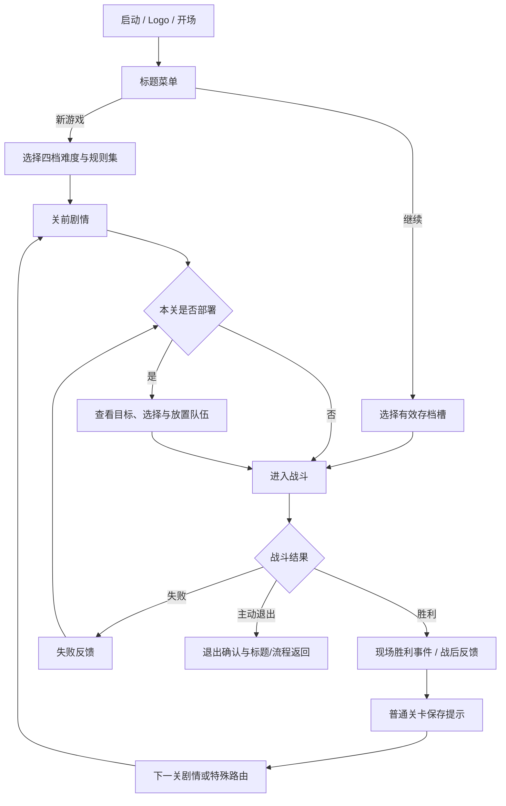
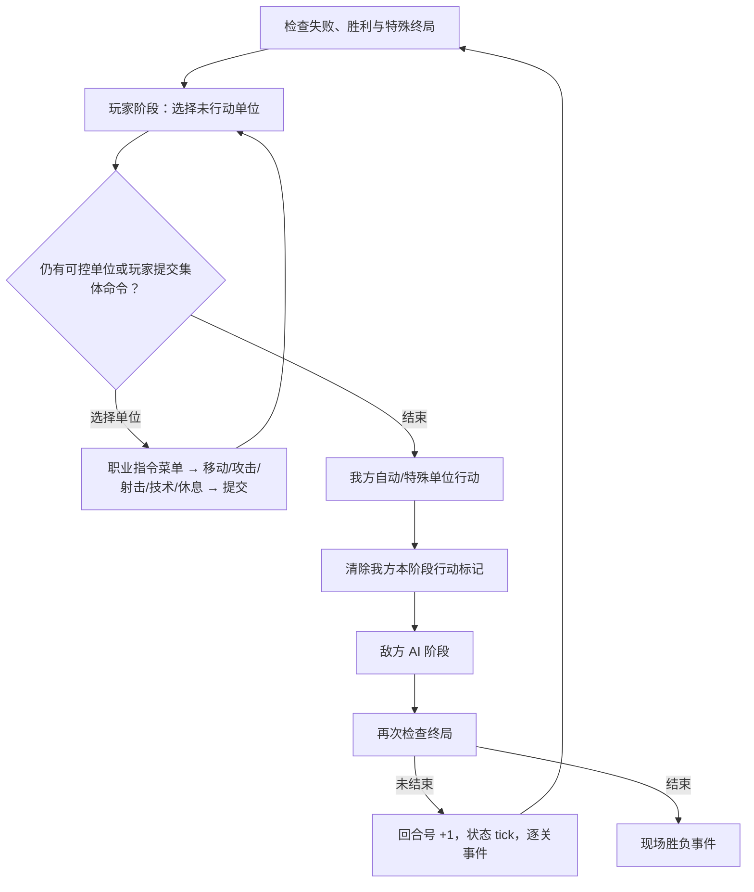

# 完整游戏循环

## 战役宏观流程

- `[OF]` 普通关卡顺序为关前剧情 → 部署/直接准备 → 战斗。
- `[OF]` 首次启动先运行模块 23 的滚动开场：`BK/41→43→48` 七张发布版背景、17 行原文和 `MUSIC/14` 共用一条约 `70.92 s` 时间轴；动画自然结束或任一操作输入跳过后进入标题。
- `[OF]` 标题由 `BK/51+52+53` 组成，默认焦点为“遊戲開始”；确认后在同一标题背景打开四档难度菜单，取消返回两项标题菜单。
- `[OF]` 失败回到同关战前准备；不是在当前棋盘即时复活。
- `[OF]` 普通胜利在现场事件后进入保存提示，再进入下一关；若关卡有特殊路由，以逐关事件为准。
- `[DD]` 复刻版保留上述节奏，但在每个转场显示明确的关卡、目标和规则集身份，避免玩家不知自己处于剧情、部署还是战斗结算。

## 新游戏与继续

### 新游戏

1. `[OF]` 播放或跳过滚动开场，进入标题菜单。
2. `[OF]` 标题选择“遊戲開始”。
3. `[OF]` 从“過關斬將、勢均力敵、困難重重、無法無天”四档难度中选择；默认值为 0，方向输入循环，副操作取消回标题。
4. `[DD]` 同时确认基础规则集；首次游玩默认推荐 `stableRemake`。
5. `[DD]` 若启用 Mod，在开始前显示内容版本和可能影响。
6. `[OF]` 确认后把难度值 0–3 带入战役与后续存档，并进入第 0 关关前剧情。

### 继续游戏

1. `[OF]` 原版提供五个编号存档槽，空槽不可确认。
2. `[DD]` 每槽至少显示关卡、主要单位职业/等级摘要、难度、规则集、Mod 状态与保存时间；原版五项可见元数据作为视觉基线。
3. `[SR]` 读取后恢复相同模拟状态和 PRNG 状态；已完成胜利存档只继续结算路由，不重播只绑定现场胜利的内容。

## 战前循环

### 关前剧情

- `[OF]` 使用背景、上下对话窗、肖像、逐字文本、音乐/音效及显式等待构成。
- `[DD]` 默认保留原版镜头与发言顺序；文本/演出加速只改变等待长度。
- `[DD]` 已看剧情可以快进；跳过规则与“是否已看”应按存档/档案记录，不影响战斗状态。

### 目标确认

- `[DD]` 进入部署或战斗前必须提供本关胜利、失败条件。
- `[OF]` 若存在原版目标文字，默认显示原文；机器胜负条件是最终规则真值。
- `[DD]` 当原文与机器条件不完全等价时，界面采用准确的现代说明，并可在资料页附原文。

### 部署

- `[OF]` 固定单位不可撤下；可选单位从名单填入 `FFh` 部署格；达到出场上限后不能再加入。
- `[DD]` 固定、已选、可选、不可用四种状态应有形状/文字差异，不能只靠颜色。
- `[DD]` 确认前可反复查看单位、地形与目标；确认后才提交战斗初态。
- `[OF]` 无部署格的关卡直接进入战斗，第 0 关属于此类。

## 完整回合循环

- `[OF]` 回合边界顺序为：敌方阶段结束 → 终局检查 → 回合号增加 → 毒/状态等完整回合 tick → 逐关事件 → 返回玩家阶段。
- `[DD]` UI 必须区分“选择中”“预览中”“已提交”“本阶段已行动”；取消预览不能被误认为撤销已提交行动。
- `[DD]` 动画可以加速或跳过，但结算顺序以规则事件为准。

## 单位行动微循环

1. 浏览或聚焦单位，不改变状态；
2. 选择一名当前可控且未行动的单位；
3. 查看职业允许的行动；
4. 选择移动格、目标或技术；
5. 预览合法性与必要信息；
6. 确认后按动作定义提交；
7. 播放表现并显示结果；
8. 返回单位选择；无可行动单位时自动进入我方自动阶段，玩家也可通过有明确副作用的集体命令提前推进。

动作是否允许“移动后再攻击”、何时消耗行动、取消到哪一层，由 [`03-battle-rules.md`](03-battle-rules.md) 和原版行动链逐项定义，不能由通用 UI 自行推断。

## 失败、胜利与保存

- `[OF]` 失败条件先后顺序和特殊胜负由关卡分发表决定；第 0 关保护妮雅并要求敌方全灭。
- `[DD]` 结算窗口必须写明触发的具体条件，而不仅显示“失败”或“胜利”。
- `[OF]` 普通失败确认后回到同关部署/准备；普通胜利可选择保存到五槽之一。
- `[SR]` 存档恢复必须包含确定性随机状态与规则身份。
- `[DD]` 自动保存若未来加入，应是额外安全副本，不替换原版五槽选择，也不得偷偷创建新的重试规则。

## 纸面切片

第 0 关的完整实例见 [`vertical-slices/stage-00.md`](vertical-slices/stage-00.md)。它是后续所有关卡规格的样板，也是解除实现冻结前必须通过的第一套端到端设计验收。
