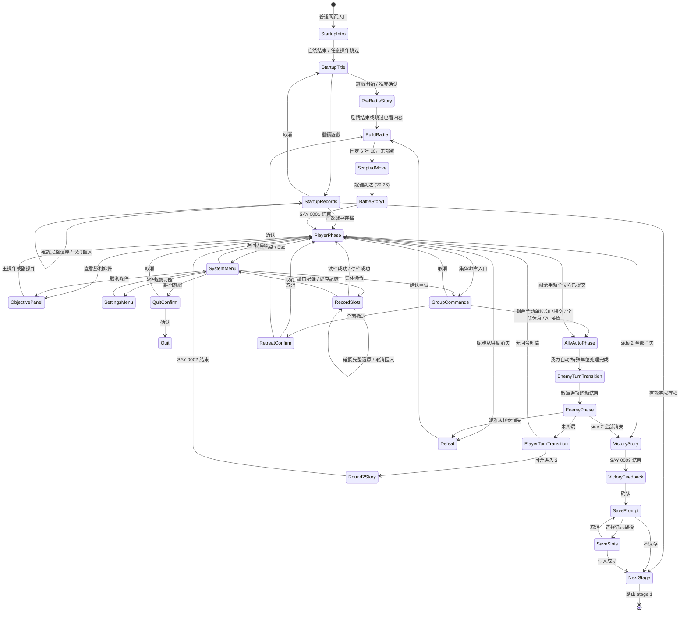

# 第 0 关 UI 状态流与交互合同

版本：Draft 0.8

适用规则集：`stableRemake`；差异项另列 `legacyStrict`

开发状态：第 0 关基础流程于 2026-07-27 获用户接受；M00.5/M00.6 与右栏热点于 2026-08-01 获用户接受

## 1. 设计结论

- `[OF]` 原版采用 `640×350` 逻辑画面，战场在左、信息区在右，地点名位于战场底栏；单位详情占 X=`480..639`。
- `[OF]` 原版胜利条件由右栏热点或系统菜单打开，主操作或副操作均可关闭，并非必须在开战前确认的阻断页面。
- `[DD]` 复刻版不新增自动弹出的关卡标题/目标页。第 0 关开场脚本进行时，底栏直接显示“瓦爾克麗宮”；玩家需要时再打开“勝利條件”。
- `[OF]` 焦点离开单位格时，原版会退出单位详情并在同一右栏恢复 `A/0006/19` 战术桌和实时小地图；焦点进入单位格时，详情叠加于变暗的小地图之上，并停止绘制其中的当前视口与单位像素标记。
- `[OF]` 肖像右侧同时有 HP 与 EXP 两条 `11×100` 有效填充区；原生填充 X 分别为 `606..616` 与 `619..629`，均由下向上增长。
- `[OF]` 右栏装饰由 `A/0006` frame `0..14` 重复拼装：单位上框占 `(480,0,160,149)`，数值/状态主体占 `(480,150,160,171)`，小地图边框占同一主体范围，回合框占 `(480,322,160,28)`；不是通用金色 CSS 边框。
- `[OF]` 妮雅、希蜜、通用士兵与哈釘的 `D` 记录均带三张眼部与三张口部覆盖片；剧情窗与战斗右栏按各自肖像元数据原点间歇播放“睁眼／半闭／闭眼／半闭／睁眼”。当前逐字发言者只在 frame 4“闭嘴”与 frame 5“小幅张嘴”之间切换；frame 6“完全张嘴”虽存在于资源中，却没有发布版对白状态可达。主肖像本身不移动。
- `[DD]` “勝利條件”、集体命令和表现/声音设置不常驻在右栏底部，统一由右栏原生热点、系统语义动作或 `Esc` 呼出的额外菜单承载。
- `[DD]` 正常战斗态不显示独立的画布外辅助区块，也不允许现代提示、浏览器工具条或 Mod 信息遮挡 `10×7` 战场。额外资料只在显式打开的系统/暂停表面出现。
- `[DD]` 战斗画面不显示新手提示浮层。原“第一次进入第 0 关显示一次‘查看勝利條件’非阻断提示”的决定已于 2026-08-19 按用户指令撤销：旧实现把它挂在全局控制器状态上，实际每关都常驻在战场左上角，且只在攻击／特殊行动／建造／打开目标之后才消失。胜利条件只由右栏原生热点、系统菜单“勝利條件”或语义目标动作打开。
- `[DD]` 可选敌军意图只写“向宮殿出口撤離”，不公开内部寻路锚点 `(25,47)` 或撤离区范围。精确格只属于调试/分析视图或明确启用的 Mod 信息层。
- `[DD]` `legacyStrict` 不显示敌军意图标签，其余画面拓扑不变。

低保真总览见：

- [第 0 关 UI 状态图](wireframes/stage-00-flow.svg)
- [战场布局与保护区标注](wireframes/stage-00-layout.svg)

## 2. 视觉方向

默认外观延续原版宫廷奇幻与 DOS 像素质感：金色雕花边、深红织物、彩色玻璃、黑/深褐信息底、原生 Big5 像素字和高对比数值。线框中的灰框只是结构标记，不表示要把成品做成现代后台面板。

战场外框直接拼装 `A/0000`：顶栏位于 `(0,0)`，左右彩色玻璃/雕像占 X=`0..39` 与 `440..479`，底座占 Y=`331..349`；这些装饰位于地图表现层之下、输入层之外，不改变 `(40,23)` 起始的 `10×7` 命中区域。

层级从低到高为：

1. 战场/剧情背景；
2. 原版装饰框、单位层、格线、范围与地图特效；
3. 右栏 HUD、底栏地点/回合；
4. 原版行动菜单、系统菜单、目标面板；
5. 剧情窗、胜负反馈、保存选择等阻断流程；
6. 按需资料页，仅在系统/暂停态出现。

同一时刻只有一个阻断层接受输入。

## 3. 状态流

`BuildBattle` 不是玩家可见的部署页面。第 0 关没有部署格，因此它只建立规范战斗状态后立即进入开场移动；跳过剧情也不得跳过这一步或脚本移动。

## 4. 玩家可见状态表

| ID | 表面 | 进入条件 | 玩家可见核心 | 合法输入 | 退出条件 |
| --- | --- | --- | --- | --- | --- |
| `S00-UI-00a` | 启动开场/标题/难度 | 普通网页入口 | 原版滚动开场、标题组合、“遊戲開始／繼續遊戲”与四档难度 | 任意操作跳过开场；导航、主操作确认；难度页副操作返回 | 新游戏进入关前剧情，或打开标题记录 |
| `S00-UI-00b` | 标题分页记录读取／备份 | 标题选择“繼續遊戲” | “讀取遊戲進度”、原版五列表头、20 个手动槽（每页五槽）、所选槽摘要及“匯出全部記錄／匯入記錄” | 上下选槽、左右翻页、主操作读取、`Esc` 返回；空槽/坏档可高亮但不得离开；导入先校验并打开默认“取 消”的完整还原确认 | 恢复玩家阶段、恢复下一关路由、完成备份／还原或返回标题 |
| `S00-UI-01` | 关前剧情 | 新游戏进入 stage 0 | `PP 1` 背景、上下剧情窗、妮雅/士兵肖像、原文；当前发言窗右下角显示“跳過” | 主操作推进/快进；点击“跳過”结束本轮 SAY；副操作仅按全局剧情政策处理 | `SAY/0000` 结束 |
| `S00-UI-02` | 战场建立/脚本移动 | 固定棋盘完成 | 底栏“瓦爾克麗宮”；镜头逐格跟随妮雅；右栏保持原版战场框架 | 普通战斗输入锁定；已看剧情加速只缩短等待 | 妮雅到 `(29,26)` |
| `S00-UI-03` | 战场剧情 | 开场移动后，或回合 2/胜利事件 | 战场被剧情窗覆盖；“跳過”跟随当前发言窗，结束后恢复原焦点与棋盘 | 剧情主操作或明确点击“跳過”；冲突战斗输入锁定 | 对应 SAY 结束 |
| `S00-UI-04` | 普通玩家阶段 | `SAY/0001` 结束 | `10×7` 战场、焦点；空地悬浮显示明亮战术桌/实时小地图/标记，点击空地后右栏上半显示职业相关地形特性并保留下方小地图；单位格在变暗且无标记的小地图上叠加详情，身份区只显示居中的职业／名字并保留 HP/EXP 双竖条；点击单位后，控制／行动、友军／敌军战术及力场摘要改在底部字幕栏按需显示；地点、回合 | 方向、主操作、副操作、系统、目标、集体命令 | 阶段提交或终局 |
| `S00-UI-04a` | 系统根菜单 | 玩家阶段中性态呼出 | 原文五项“遊戲功能／勝利條件／讀取記錄／儲存記錄／離開遊戲”；背景保留原右栏焦点态 | 导航/主操作选择；副操作返回 | 返回战场、打开对应子表面 |
| `S00-UI-04b` | 游戏功能/战中记录/退出确认 | 从系统根菜单选择 | 游戏功能严格显示“人物圖像／戰鬥動畫／地圖方格／地圖捲動／ＡＩ對話”五项 `ON/OFF`；战斗动画首次为 `ON`；记录使用 20 个分页手动槽，底部可直接“匯出／匯入”；退出使用 `D/46` 肖像、原文与确认菜单 | 游戏功能上下循环、主操作切换、副操作返回；记录上下选槽、左右翻页；导入确认默认“取 消”并阻断战场输入；反馈逐字时首次主操作只补全文字 | 返回根菜单、恢复战场快照、完成备份／还原或退出 |
| `S00-UI-05` | 胜利条件 | 目标动作或系统菜单选择 | 准确胜利/失败文本；背景战斗暂停接收指令 | 主操作或副操作关闭 | 返回原战场状态 |
| `S00-UI-06` | 行动菜单/范围 | 选中合法单位或动作 | 选中单位先显示职业菜单且不显示范围；鼠标／触控选取时不播放虚拟手形滑行。基础菜单为“移动／攻击／休息”。确认移动后才显示范围；合法格全亮、非法格按 `11h/44h` 网点压暗。移动后切换为“攻击／结束／返悔” | 上下/悬停选择菜单，主操作确认，副操作逐层返回；范围态使用方向/指针选格 | 提交动作或回到中性战场 |
| `S00-UI-06a` | 集体命令/命令对白/撤退确认 | 玩家阶段中性态呼出 | “全部休息／跟随主将／自由行动／全面撤退”；全部休息与自由行动按 `REMAKE-122` 固定由本关主将（本关是妮雅）在上方窗口发出，跟随主将由玩家刚指定的临时主将发出，逐字结束后才结算；跟随主将要求焦点位于尚未行动的我方单位；撤退使用 `D/46`、原文和原版确认菜单 | 导航、主操作确认、副操作取消；逐字时首次主操作只补全文字；前三项对白无第二次确认并自动执行 | 我方自动阶段、重建本关或返回战场 |

- `[OF]` 行动菜单和集体命令复用 `A/0001` frame `00/05..08`：`144 px` 原生宽度、
  `24 px` 行距、红橙单像素棋盘底纹、蓝/红宝石顶角、金色顶底框、当前行银色横饰与
  `24×24` 手形指针；N 行外高为 `24N+28 px`。Web 运行时必须保持整数像素和
  `image-rendering: pixelated`，不能退回普通渐变按钮或平滑缩放。
- `[DD]` Web 菜单的红橙棋盘纹理以 `50%` 透明度铺满整个 `144×(24N+28)` 外框，
  不保留上下黑色填充带；`A/0001` frame 0 只作为实际鼠标光标，不在键盘选中行后
  额外绘制第二个固定手指。两字单位命令保留原版疏排，只用半字距补偿 CSS 的尾随
  `letter-spacing`，让实际字形中心与 `144 px` 菜单中心线重合；长技术名和四字集体
  命令继续使用各自字距。
- `[OF]` 模块 29 `1000:29A2` 的游戏功能表面是独立构图，不使用 `A/0001` 通用菜单框：
  面板原点 `(280,40)`、尺寸 `128×175`，黑色投影偏移 `(16,16)`，标题原文为
  “子 選 單”；五个命中行从 `(288,78)` 开始，尺寸 `112×24`、行距 `25 px`，标签
  顺序为“人物圖像／戰鬥動畫／地圖方格／地圖捲動／ＡＩ對話”，状态只显示 ASCII
  `ON/OFF`。Web 使用原版调色板黑、棕、红、黄、白和 `A/0001` frame 0 手形光标复现，
  不再显示音效、音乐、集体命令、动画倍速或“返回”等非原版条目。
- `[DD]` 五项系统根菜单，以及胜利存档、全面撤退和离开游戏的“確 定／取 消”选择，
  同样使用上述 `A/0001` 通用菜单外框、当前行横饰和手形光标；两项确认菜单外高为
  `76 px`，五项系统菜单外高为 `148 px`。标题、难度、设置与转职等已有独立原版或
  产品构图的表面不套用通用菜单外框。
- `[OF]` 记录槽不是通用选单，而是弹出式资料面板：模块 23 与模块 29 内嵌同一行 Big5
  表头“職業/等級/經驗值/儲存次數/難度”，逐槽列出元数据，列横坐标为
  `96/160/216/288/336`；空槽五列填 `XX`，空槽可高亮但确认后留在本状态
  （`reverse/notes/save-slot-format.md`、`reverse/notes/title-presentations.md`、
  `reverse/gdd/evidence-register.md` 的 `SAVE-002`）。
- `[DD]` 战中“儲存記錄／讀取記錄”与战后“儲存遊戲進度”按上述原版面板构图复刻，不套用
  `A/0001` 通用选单外框：奶白外框、深棕面板底、逐槽凸起横条、当前槽绿色高亮，面板
  `(44,32)`、`432×252`，整体落在战场 `40..480` 之内。两个表面共用同一渲染器，战后
  存档只是没有“取 消”一列。
- `[DD]` 面板列改为“槽／關卡名／回合數／儲存次數／難度”。原版前三列
  “職業/等級/經驗值”取自保存器进入前的工作单位快照，且 `經驗值` 固定来自 side 1 槽 0，
  三者对复刻版玩家没有辨识价值（该快照不一致本身是已确认的发布版怪癖，见
  `SAVE-008`）；改用关卡名与回合数后，同一关的多个记录才能互相区分。后两列
  “儲存次數／難度”保留原版语义。空槽不填 `XX`，改为跨列显示“此處沒有記錄”。
- `[DD]` 二十槽分页是 Web 侧需求，放在面板底部一列：左侧翻页箭头与“第 n／N 頁”居中，
  “取 消”右对齐。标题“讀取遊戲進度”表面的原版五列构图不受本条影响，仍按 `[OF]` 保留
  “職業/等級/經驗值/儲存次數/難度”。
- `[DD]` 标题记录表面在槽摘要下方增加“匯出全部記錄／匯入記錄”；战中储存／读取面板复用
  同一逻辑，在底部原本空置的左栏增加紧凑“匯出／匯入”，不移动五个槽、居中分页或右侧
  “取 消”，战后单次存档面板不显示。导出下载一个独立版本化 JSON；导入文件在内存中完成
  外壳、20 槽数量及逐槽普通存档校验后才显示确认层。确认层阻断所在记录面板和战场输入、
  默认落在“取 消”，并明确说明备份空槽会清空当前同号槽；取消或坏文件都不得改变
  `localStorage`。战中确认还原后只刷新槽位显示，当前内存战局保持不变。
- `[OF]` 原版通用选单会移动位置以避开当前指针与右侧资讯栏矩形，该资讯栏精确占用
  `x=480..639`（`reverse/notes/input-and-battle-ui.md` 的“通用行动菜单”一节，
  `reverse/parsed/native/input-ui.json` 的 `unitHud.positioning`）。
- `[DD]` 通用外框的红橙棋盘纹理只有 50% 不透明度，覆盖右侧战术栏会透出栏内文字；
  与上一条原版避让规则同向，所有套用 `A/0001` 外框的表面一律靠右对齐到战场边界
  `480 px` 之内：胜利存档、全面撤退与离开游戏三处共用的两项确认菜单 `(336,110)`。
  记录槽面板不用该纹理，但按同一避让规则整体落在战场之内。
- `[DD]` 两项确认菜单没有已取证的原版座标：证据只记下 `DS:3F2C` 的两项确认表、逐行
  `136×24` 热区和接受 x/y 参数的通用选单绘制例程，没有留下呼叫端座标。
  `(384,110)` 是五槽编号存档选择器的 `pointerTarget`，不属于确认菜单，不能反过来
  当作它的原版位置。
- `[OF]` `A/0001` frame `0..4` 是完整五态鼠标组：普通区域用 `24×24` 手指；战场
  上、下、左、右边缘分别用 frame `1/2/3/4` 的白色方向箭头。四角按原版方向槽
  写入顺序由纵向箭头优先；关闭“地圖捲動”只停止无按键悬停时的自动移动，不取消
  边缘箭头。箭头处主操作仍立即移动一格，按住重复，松开停止。
- `[DD]` Web 在整个 `640×350` 逻辑画面（标题、剧情、右栏、菜单和战场内部）使用
  原版手指，战场边缘按上述五态切换；不再显示系统箭头、十字或 resize 光标，也不为
  移动、攻击和禁用按钮虚构原版未提供的额外状态图。
| `S00-UI-06b` | 我方自动阶段 | 手动单位全部提交或选择 AI 接管 | 逐单位显示移动、攻击、休息与行动完成；玩家战斗输入锁定 | 仅表现速度控制 | 敌方阶段或即时终局 |
| `S00-UI-06c` | 敌军回合过渡 | 我方自动阶段正常结束 | `[OF]` 先保留战场 100 native tick；随后 `A/19`“敵軍進攻”人物按 24 个离散帧从右向左跑过，配黑色影子、六枚 `A/26` 边缘尘团和多段小跳；首帧切入敌方音乐 | 战斗输入锁定；表现速度只缩短等待 | 敌方规则入口 |
| `S00-UI-07` | 敌方阶段 | 玩家阶段结束 | 敌人沿实际可通行格逐段折线移动；本次行动停在撤离区内即当场消失；可选高层“撤離”意图不公开精确格 | 仅允许表现速度控制、系统级暂停 | 下一单位、下一回合事件或即时终局 |
| `S00-UI-07a` | 我军回合过渡 | 敌方阶段正常结束且未终局 | `[OF]` 先保留战场 100 native tick；随后 `A/19`“我軍進攻”人物按 20 个离散帧从左向右跑过，配黑色影子、六枚 `A/26` 边缘尘团和两次跳跃；首帧切回我方音乐 | 战斗输入锁定；表现速度只缩短等待 | 下一回合 tick／剧情／玩家阶段 |
| `S00-UI-08` | 失败反馈 | 妮雅从棋盘消失 | `D/46` 肖像与失败原文逐字显示 | 第一次主操作补全，第二次确认 | 重建本关固定初态 |
| `S00-UI-09` | 胜利反馈 | `SAY/0003` 结束 | `D/46` 肖像与胜利原文逐字显示 | 第一次主操作补全，第二次确认 | 保存询问 |
| `S00-UI-10` | 保存询问 | 胜利确认后 | 是否记录本次战役 | 选择、确认、取消 | 分页手动槽选择或下一关 |
| `S00-UI-11` | 分页手动槽选择 | 选择保存 | 原版位置每页显示五个编号槽及现有记录摘要，共四页 20 槽 | 上下选槽、左右翻页、确认、副操作返回；已有槽直接覆盖 | 保存成功或返回询问 |

## 5. 战场构图合同

### 逻辑画布内

- `[OF]` 画面始终按 `640×350` 构图；X=`0..479` 属于战场框，X=`480..639` 属于右栏。
- `[OF]` 实际 `10×7` 图块原点为 `(40,23)`，单格 `40×44`；战场输入内区约为 X=`40..432`、Y=`26..325`。
- `[OF]` `A/0000` 外框覆盖 X=`0..39/440..479`、Y=`0..22/331..349` 等装饰区；雕像和玻璃不属于地图格，也不能接收选格输入。
- `[OF]` 单位详情肖像为 `112×112`，落点 `(488,8)`；身份行为“职业／单位名”；五项数值从 Y=`154` 开始；回合文字原点 `(516,327)`。
- `[OF]` 右栏与底栏的文字由 `0000:EA04` 用原版 `16×15` 点阵字绘制：全角进 16px、半角进 9px、空白 8px，外框是纵向膨胀掩码画在 `(x,y)` 与 `(x+2,y)`、本体画在 `(x+1,y+1)`。职业靠右、单位名靠左各填进八字节缓冲，五行数值是 `DS:5E64..5EA2` 的完整样板字符串，数值栏把前导零改成空格，**不靠右对齐到面板内缘**。详见 [`battle-text-rendering.md`](../../../reverse/notes/battle-text-rendering.md) 与 `REMAKE-117`。
- `[OF]` 右栏肖像的眨眼只重绘 frame 1–3 眼部覆盖片；不得用整图透明度、缩放或通用闭眼贴图近似。
- `[OF]` 剧情发言口型在肖像元数据第三、第四个布局字节指定的原点重绘 frame 4/5；两套解释器均在每个 `AL > 7Fh` 的 Big5 双字节字形后以 `XOR 1` 切换状态，ASCII 字形不切换，等待输入时把状态清零。frame 6 不可达，口部仍可与眨眼同时显示。
- `[OF]` HP/EXP 有效填充区分别位于 X=`606..616` 与 `619..629`、Y=`8..107`；高度分别为 `floor(当前生命×100/最大生命)` 与 `floor(当前经验×100/下一经验阈值)`。
- `[OF]` 无单位焦点时，`A/0006/19` 以 `(480,0)`、`160×149` 填入右栏上半；`150×150` 小地图从 `(485,161)` 开始，并叠加当前视口和双方单位标记。
- `[OF]` 小地图上下由 `A/0006/9、10` 落在 Y=`150/311`，左右由 frame `6/7` 从 Y=`160` 起重复；单位态复用 frame `0..8、14` 包围肖像和双竖条，五行/状态区按原生调色板矩形分隔，frame `11..13` 拼成底部回合框。
- `[OF]` `A/0006/19` 只是战术桌底图；原版随后把戰鬥動畫 `20/21`、地圖方格 `24/25`、地圖捲動 `26/27`、人物圖像 `30/31` 的关闭/开启局部帧覆盖到各自物件上。四组画面与对应表现状态同源并随点击立即更新；其余热点不因此获得未经证实的二态。
- `[OF]` 有单位焦点时仍以小地图为下层，但整体压暗，并隐藏小地图中的视口框与双方单位标记；单位详情从其上方覆盖。焦点回到空地后立即恢复明亮小地图及标记。
- `[OF]` 那层压暗是 `DS:5FD1` 的 `20×2` 图案以色 0 打的 50% 棋盘点阵（`(480,150)` 起、2 行步长、86 次），不是半透明遮罩；五行之间只有色 14 的横线加色 0 的上缘阴影与左右内缩线，没有行底白线。
- `[OF]` 第 0 关开场移动结束后，视口原点为 `(25,23)`，焦点为 `(29,26)` 的妮雅。
- `[OF]` 鼠标进入战场框的上 `<26`、下 `>=326`、左 `<40`、右 `>=433` 边缘区时按方向滚动视口；下方地点名称 banner 的完整可见区域 X=`80..399`、Y=`331..349` 同样属于向下滚屏热区。停留会连续逐格滚动，返回内区、右栏或画布外即停止。
- `[DD]` 边缘滚屏只改 `cameraOrigin`，不改逻辑焦点、单位坐标、选择、范围或行动状态；方向键导航仍移动逻辑焦点并按需重定位镜头。
- `[OF]` 底栏地点条是 `DS:3051` 的 `(0,332,480,18)` 色 14 与 `DS:305B` 的 `(80,333,320,16)` 色 1 两条矩形，`A/0000` 的 frame 6/7 随后盖掉两端；文字光标固定在 `(120,333)`，横向落点由 `SAY` 记录自带的定位字元决定，第 0 关的 `SAY/119` 是一个制表符，即从 X=`192` 起。
- `[DD]` 地点名“瓦爾克麗宮”保持底栏常驻，不再复制为中央标题卡。
- `[DD]` 无单位详情覆盖时，原版右栏 12 个物件热点使用已验证的包含端点坐标；正常态透明无框，鼠标悬停 `450 ms` 后在战术桌下缘显示原文提示，键盘或辅助技术焦点即时显示提示与轮廓。任一阻断层、动画锁或单位详情出现时，热点退出顺序焦点并立即隐藏提示。
- `[DD]` 依 `REMAKE-015`，玩家阶段中性态点击无单位格后，右栏上半 `160×149` 区域改为
  地形特性卡；卡片显示按本关图块校订的 `[DD]` 地形分类名、坐标、最近一次明确焦点
  单位／职业、进入损耗、攻击加成“无”及地形防御百分比和折算点数，不向玩家显示内部
  逻辑槽号；下方 `150×150` 小地图、视口和单位标记保持可见。
  卡片开启时战术桌透明热点停用；点击另一空格更新，点击单位进入原有单位交互，次操作、
  关闭按钮或打开其他按需界面时收起。移动、攻击、射击和技术选格优先，不得被地形卡截获。

### 逻辑画布外

可选的键位帮助、规则集、Mod 来源、术语解释和精确公式属于系统/暂停资料页，不能作为正常战斗旁的常驻区块。它必须满足：

- 默认关闭，不与原版右栏争夺视觉焦点；
- 收起后逻辑画布仍居中且比例不变；
- 不改变战场坐标与鼠标命中换算；
- 窗口不足时完全折叠，不把 `10×7` 战场压缩成更少格。

## 6. 语义动作表

第 0 关复刻默认采用现代 PC 游戏键位，同时把不冲突的原版键保留为相容别名：

- 方向：方向键或 `W/A/S/D`；斜向仍可使用 `Home/PageUp/End/PageDown`；
- 主操作：`Enter/Space` 或鼠标左键；`Ctrl/Insert` 为原版相容键；
- 次操作：`Esc/Backspace` 或手柄 `B`；`Alt/Delete` 为原版相容键；活动层存在时 `Esc` 先返回，中性战场时打开系统菜单；
- 鼠标右键：当前存在移动/目标/行动菜单或可取消面板时先逐层取消并消费该次输入；仅在中性战场循环对焦下一名尚未行动的我方单位；
- `Tab` 对焦下一名未行动友军，`G` 集体命令，`O` 胜负条件；部署画面的 `Tab` 改为切换名单与地图落点；
- `[OF]` `E/M` 分别打开“音效開關”四项分类面板与五档音乐音量面板；`[DD]` Web 的音效面板另提供不改变四项请求门的五档总音效音量，默认 `2`（50%）。
- `F1/F2/F3/F4` 分别直接执行全部休息、跟随主将、自由行动、全面撤退。

| 语义动作 | 键盘 | 鼠标 | 手柄 | 第 0 关用途 |
| --- | --- | --- | --- | --- |
| `navigate` | 方向键／`WASD` | 指针移动/菜单悬停/战场边缘驻留 | 十字键/左摇杆 | 移动焦点、滚动视口、菜单选择、目标选择 |
| `primary` | `Enter/Space`（兼容 `Ctrl/Insert`） | 左键/主按钮 | `A` | 选择单位、确认动作、推进文本 |
| `secondary` | `Esc/Backspace`（兼容 `Alt/Delete`） | 右键／明确的返回按钮 | `B` | 逐层取消；关闭目标面板 |
| `nextUnactedAlly` | `Tab` | 中性战场右键 | `RB` | 按固定我方编队顺序循环并跳过已行动单位；只更新焦点和镜头；若右键已用于逐层取消，本动作不得继续执行 |
| `system` | 中性战场 `Esc` | 右栏系统入口 | `Menu/Start` | 打开游戏功能/目标/存读档/退出 |
| `objectives` | `O` | 右栏目标入口 | `View/LB` | 直接打开当前胜利/失败条件 |
| `groupCommand` | `G` | 右栏集体命令入口 | `Y` | 全部休息、跟随主将、自由行动、撤退 |
| `presentationSpeed` | 按住加速键 | 按住已配置按钮 | 按住已配置按钮 | 只缩短已看剧情/动画等待，不改变结果 |
| `browserAssist` | 资料页键 | 系统/暂停入口 | 不要求默认绑定 | 打开规则/键位/Mod 资料，不进入模拟 |

焦点规则：键盘/手柄最后一次导航后显示逻辑焦点；鼠标进入画布后以指针命中为焦点来源。设备切换不能提交动作，只有 `primary` 或明确快捷动作可以提交。

移动或攻击候选态中，原版黑白斜面候选框必须随指针经过的战场格即时移动，但悬浮本身不提交动作。原版棋子上没有敌我色环，选中状态只由这一个候选框表达；确认移动后，候选框固定在最终目标格直至逐格动画结束，不得在路径前方逐格跳动。

## 7. 第 0 关信息披露

### 常驻信息

- 地点“瓦爾克麗宮”；
- 当前回合；
- 无单位焦点时的战术桌、实时小地图、视口与双方标记；有单位焦点时的身份、生命、攻击、防御、等级、经验与状态；
- 单位详情肖像右侧的 HP/EXP 双竖条；
- 阵营、焦点和已行动状态。
- 单位详情身份区只显示职业／单位名；点击单位后，底部字幕栏为玩家显示
  “玩家・可行动／已行动／冰封中”，为自动友军显示“友军・战术…”，为敌军显示战术，
  并按需追加力场安全性。悬浮不显示这些摘要，且不会因关卡是否已登记显式军团而改变文案。

### 按需信息

- 胜利：“清除瓦爾克麗宮内的敌人”；
- 失败：“妮雅战败”；
- 敌人高层意图：“向宫殿出口撤离”；
- 规则集、Mod 来源、详细公式；空地点击提供当前职业相关的精简地形特性。

### 禁止默认公开

- 行为 12 的内部编号；
- 撤离寻路锚点的精确线性格 2375 / 坐标 `(25,47)`，以及格号大于 2271 的撤离区范围；
- AI 路径搜索预算、PIT 路径分歧或开发调试字段；
- 四个通用士兵的内部占位名 `xxxx18..xxxx21`（`REMAKE-107` 公开的是派生字母 `A..D`，不是占位串本身）。

## 8. 响应式与可访问性

- `[DD]` 优先整数倍放大；非整数缩小时仍提供最近邻/像素清晰模式。
- `[DD]` 窄屏以完整逻辑画布优先，允许页面滚动或沉浸式全屏，不重排画布内部 HUD。
- `[DD]` 高可读字体可替换字形外观，但不得改变台词、单位名、分页事件或面板拓扑。
- `[DD]` 阵营、合法范围与已行动状态必须有颜色之外的轮廓/图案差异。
- `[DD]` 减少闪烁和动画加速只改变表现；剧情窗、胜负和覆盖保存仍需明确确认。

## 9. 可执行验收

1. 关前剧情跳过后，不出现部署页或新造的标题确认页。
2. 开场镜头跟随妮雅并最终显示 `(25,23)` 视口、`(29,26)` 焦点与底栏“瓦爾克麗宮”。
3. 玩家取得控制后立即可以选择单位；战场上不出现任何新手提示浮层。
4. 用键盘、鼠标或手柄语义动作均能打开并关闭胜利条件，关闭后恢复完全相同的战场选择态。
5. 原貌模式不显示敌军意图；`stableRemake` 辅助模式最多显示“向宫殿出口撤离”，不显示寻路锚点或撤离区坐标。
6. 失败明确显示“妮雅戰敗”并回到同关固定初态；胜利依次进入现场剧情、胜利反馈、保存询问和分页手动槽选择。
7. 悬浮单位即可出现详情覆盖层；移到空地即恢复明亮小地图。详情态不绘制小地图视口框或单位标记，HP 与 EXP 两条竖条同时存在且按各自比例填充；职业／名字在身份区空白范围内居中且没有第二行。点击单位后，控制／战术／力场摘要出现在底部字幕栏，范围颜色说明不再占用该次选中的核心反馈位置。
7a. 玩家阶段中性态点击空地后，右栏上半显示该格逻辑槽、坐标，以及对最近一次明确焦点
单位的移动损耗、攻击加成“无”和防御加成百分比／折算点数；下方小地图与标记保持可见，
战术桌热点暂时停用。检查与关闭不改变单位、行动位、镜头、胜负或 PRNG；移动／目标选择
中的空格点击继续执行原动作语义。
8. 正常战斗右栏不出现常驻功能按钮；系统菜单可由热点/语义动作呼出，关闭后恢复相同焦点与 HUD 状态。
9. 系统/暂停资料页开关、浏览器缩放、表现加速均不改变逻辑画布坐标、模拟状态或 PRNG。
10. 玩家、脚本和 AI 移动都按寻路器输出的相邻格序列逐段播放；每段只能横向或纵向进入相邻格，不能把起终点压成一条直线补间。进入出口后的移除和胜利检查发生在当前单位移动结束时。
11. 点击尚未行动的基础职业单位后先出现“移动／攻击／休息”菜单且范围为空；选择移动才显示合法范围，完成移动后菜单变为“攻击／结束／返悔”。
12. 鼠标进入战场任一边缘区会立即滚动一格并在驻留时连续滚动，其中地点名称 banner 全域都可触发向下滚屏；离开边缘立即停止，视口始终夹取在地图范围内，且滚屏前后的逻辑焦点、单位与行动状态完全相同。
13. 剧情肖像和右栏单位肖像会以重新抽取的随机间歇完成三阶段眨眼；覆盖片尺寸、角色对应与元数据落点准确，镜头滚动或同一角色 HUD 重绘不中断其表现周期，战斗状态与 PRNG 不发生变化。当前逐字发言肖像只按 Big5 双字节字形交替 frame 4/5，ASCII 字形保持当前口型，frame 6 不得出现；补全文字或切换发言窗口后立即闭嘴。
14. 战场不存在无副作用的“回合结束”。全部休息会恢复并提交所有剩余手动单位；跟随主将与自由行动会进入可见的我方自动阶段；全面撤退必须确认，取消不改变棋盘，确认重建本关固定初态。
14a. 全部休息、跟随主将与自由行动都先显示妮雅 `D/46` 上方逐字命令窗，正文分别使用 DS:`86E4h/873Ch/8716h` 的原文；对白显示期间棋盘、行动位和 PRNG 不变，窗口自动结束后才执行命令。皮鞋直达、地图子菜单和 F1–F3 必须复用同一顺序。
14b. 鼠标移到空地以恢复战术桌时，只改变右栏表现光标，不清除战斗层最近一次明确选择的单位焦点；从地图物件打开集体命令后，“跟随主将”必须沿用该焦点判定可用性和主将身份。该焦点已行动或不属于我方时仍禁用。
15. `Esc/Backspace` 负责取消／返回；活动操作或面板存在时只取消当前层并消费输入，中性战场的 `Esc` 才打开系统菜单。`Enter/Space` 始终是确认／主操作。鼠标右键不显示浏览器菜单：有活动操作或面板时只取消当前层并消费事件，中性战场才按固定我方编队顺序循环对焦下一名尚未行动单位；键盘 `Tab` 与手柄 `RB` 走同一循环，循环一周不改变棋盘、行动位或 PRNG。
16. 小地图悬停显示 `30×21` 白色预览框并夹取在 `150×150` 范围内；点击将焦点设为预览原点 `+4,+3` 并移动视口，但棋盘快照和 PRNG 完全不变。
17. 玩家移动与攻击范围只让合法格保持全亮，其余可见格逐格应用精确 25% 像素网点；普通攻击 0/1/多目标分别走反馈留层、自动锁定、手动目标选择三条分支。
18. 系统根菜单严格按原文五项排列；战中存档恢复当前玩家阶段的回合、单位、焦点、视口和 PRNG，读取时不新开回合；空槽读取被拒绝。
19. 胜利、失败、撤退和退出均完整复用常规 `A/18` 上方剧情窗几何：肖像主图位于 `(32,26)`，
    `400×86` 文字窗位于 `(153,10)`，与肖像完整纹理右缘相隔 6 px；逐字未完成时主操作只补全文字，之后才执行
    重试、保存、撤退或退出选择；胜利手动槽覆盖不弹出额外确认。
20. 每轮关前、战场或胜利 SAY 对话均显示“跳過”：有当前发言窗时停靠其右下角并随上下窗切换移动，原生空白等待检查点则停靠剧情层右下角。点击后直接到达该轮剧情正常结束状态，不提交战斗输入、不绕过妮雅脚本移动、回合结算、胜利反馈或保存询问。
21. 移动/攻击范围打开后，鼠标悬浮候选格会移动黄色候选框而不改变单位坐标或行动状态；点击合法格才提交。移动动画期间候选框保持在最终目的地，角色沿实际路径逐格更新。
22. 在同一网页来源保存后刷新普通入口，标题四页共 20 个手动槽仍能读取有效记录；1–5 号旧槽保持原键兼容，第 20 槽也可从标题、战中和战后入口写入/读取；战中档精确恢复难度、回合、单位、焦点、视口和 PRNG，完成档进入下一关占位；空槽、损坏或不兼容记录均留在标题并给出可见反馈。
23. 标题记录面板与战中储存／读取面板都能把全部可读槽导出为版本化 JSON；损坏槽明确报告
    且不混入备份。导入坏文件不改动现有槽；有效备份显示时间、数量与空槽覆盖说明，默认确认
    项为“取 消”。确认后精确还原全部 20 槽并把旧格式槽迁移到当前 schema；写入失败则显示
    回滚结果。战中还原后面板留在原处并立即显示新槽位，当前单位、回合、焦点、视口和 PRNG
    不变。

以上状态已映射到 [`startup.spec.ts`](../../../tests/e2e/startup.spec.ts) 的 `BOOT-A/BOOT-B/BOOT-C` 与 `BOOT-B backup/restore`、[`tests/e2e/stage0.spec.ts`](../../../tests/e2e/stage0.spec.ts) 的 `S00-A` 至 `S00-N`、`RHP-03b`，并由 [`stage0-real-clear.spec.ts`](../../../tests/e2e/stage0-real-clear.spec.ts) 的 `S00-O` 在无 `?test=1`、无调试 API 条件下完成真实通关。浏览器测试同时保存标题记录第 1/4 页、标题第 4 页、标题备份导入确认、读档后战场、战中记录第 4 页、战中备份入口与导入确认、战后保存第 4 页、空地战术右栏、单位详情覆盖、EXP 非零、系统菜单、退出/撤退反馈、全景战斗、结算完成和窄屏等代表性截图，并对最终 stage 1 路由做黄金截图比较；第 0 关已由用户完成手动视觉与手感验收。
