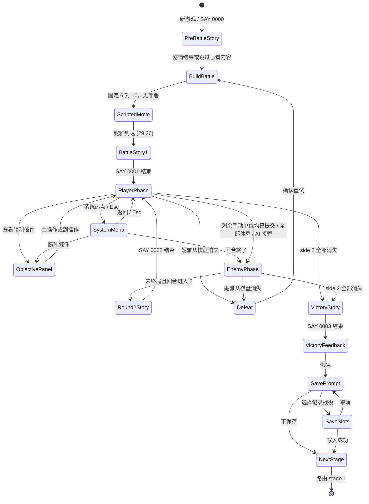

# 第 0 关 UI 状态流与交互合同

版本：Draft 0.3

适用规则集：`stableRemake`；差异项另列 `legacyStrict`

开发状态：第 0 关实现例外已解除冻结；`implementationCandidate=true`，自动验收通过

## 1. 设计结论

- `[OF]` 原版采用 `640×350` 逻辑画面，战场在左、信息区在右，地点名位于战场底栏；单位详情占 X=`480..639`。
- `[OF]` 原版胜利条件由右栏热点或系统菜单打开，主操作或副操作均可关闭，并非必须在开战前确认的阻断页面。
- `[DD]` 复刻版不新增自动弹出的关卡标题/目标页。第 0 关开场脚本进行时，底栏直接显示“瓦爾克麗宮”；玩家需要时再打开“勝利條件”。
- `[OF]` 焦点离开单位格时，原版会退出单位详情并在同一右栏恢复 `A/0006/19` 战术桌和实时小地图；焦点进入单位格时，详情叠加于变暗的小地图之上，并停止绘制其中的当前视口与单位像素标记。
- `[OF]` 肖像右侧同时有 HP 与 EXP 两条 `11×100` 有效填充区；原生填充 X 分别为 `606..616` 与 `619..629`，均由下向上增长。
- `[DD]` “勝利條件”“回合終了”和表现/声音设置不常驻在右栏底部，统一由右栏原生热点、系统语义动作或 `Esc` 呼出的额外菜单承载。
- `[DD]` 正常战斗态不显示独立的画布外辅助区块，也不允许现代提示、浏览器工具条或 Mod 信息遮挡 `10×7` 战场。额外资料只在显式打开的系统/暂停表面出现。
- `[DD]` 第一次进入第 0 关时显示一次非阻断提示：“查看勝利條件：保護妮雅，清除宮內敵人。”提示不夺取焦点，不要求确认，并在首次打开目标或完成一次玩家动作后淡出。
- `[DD]` 可选敌军意图只写“向宮殿出口撤離”，不公开内部寻路锚点 `(25,47)` 或三格出口区域。精确格只属于调试/分析视图或明确启用的 Mod 信息层。
- `[DD]` `legacyStrict` 不显示新手提示和敌军意图标签，其余画面拓扑不变。

低保真总览见：

- [第 0 关 UI 状态图](wireframes/stage-00-flow.svg)
- [战场布局与保护区标注](wireframes/stage-00-layout.svg)

## 2. 视觉方向

默认外观延续原版宫廷奇幻与 DOS 像素质感：金色雕花边、深红织物、彩色玻璃、黑/深褐信息底、原生 Big5 像素字和高对比数值。线框中的灰框只是结构标记，不表示要把成品做成现代后台面板。

战场外框直接拼装 `A/0000`：顶栏位于 `(0,0)`，左右彩色玻璃/雕像占 X=`0..39` 与 `440..479`，底座占 Y=`331..349`；这些装饰位于地图表现层之下、输入层之外，不改变 `(40,23)` 起始的 `10×7` 命中区域。

层级从低到高为：

1. 战场/剧情背景；
2. 原版装饰框、单位层、格线、范围与地图特效；
3. 右栏 HUD、底栏地点/回合；
4. 原版行动菜单、系统菜单、目标面板；
5. 剧情窗、胜负反馈、保存选择等阻断流程；
6. `stableRemake` 非阻断提示；
7. 按需资料页，仅在系统/暂停态出现。

同一时刻只有一个阻断层接受输入。非阻断提示永远不改变主操作、副操作或方向动作的接收者。

## 3. 状态流

`BuildBattle` 不是玩家可见的部署页面。第 0 关没有部署格，因此它只建立规范战斗状态后立即进入开场移动；跳过剧情也不得跳过这一步或脚本移动。

## 4. 玩家可见状态表

| ID | 表面 | 进入条件 | 玩家可见核心 | 合法输入 | 退出条件 |
| --- | --- | --- | --- | --- | --- |
| `S00-UI-01` | 关前剧情 | 新游戏进入 stage 0 | `PP 1` 背景、上下剧情窗、妮雅/士兵肖像、原文 | 主操作推进/快进；副操作仅按全局剧情政策处理 | `SAY/0000` 结束 |
| `S00-UI-02` | 战场建立/脚本移动 | 固定棋盘完成 | 底栏“瓦爾克麗宮”；镜头逐格跟随妮雅；右栏保持原版战场框架 | 普通战斗输入锁定；已看剧情加速只缩短等待 | 妮雅到 `(29,26)` |
| `S00-UI-03` | 战场剧情 | 开场移动后，或回合 2/胜利事件 | 战场被剧情窗覆盖，结束后恢复原焦点与棋盘 | 剧情主操作；冲突战斗输入锁定 | 对应 SAY 结束 |
| `S00-UI-04` | 普通玩家阶段 | `SAY/0001` 结束 | `10×7` 战场、焦点；空地显示明亮战术桌/实时小地图/标记，单位格在变暗且无标记的小地图上叠加详情与 HP/EXP 双竖条；地点、回合；首次可有非阻断提示 | 方向、主操作、副操作、系统、目标、集体命令 | 阶段提交或终局 |
| `S00-UI-04a` | 系统菜单 | 玩家阶段中性态呼出 | 独立弹窗内显示胜利条件、回合终了和表现/声音控制；背景保留原右栏焦点态 | 导航/主操作选择；副操作返回 | 返回原战场、打开目标或提交阶段 |
| `S00-UI-05` | 胜利条件 | 目标动作或系统菜单选择 | 准确胜利/失败文本；背景战斗暂停接收指令 | 主操作或副操作关闭 | 返回原战场状态 |
| `S00-UI-06` | 行动菜单/范围 | 选中合法单位或动作 | 选中单位先显示职业菜单且不显示范围；基础菜单为“移动／攻击／休息”。确认移动后才显示范围，移动后切换为“攻击／结束／返悔” | 上下/悬停选择菜单，主操作确认，副操作逐层返回；范围态使用方向/指针选格 | 提交动作或回到中性战场 |
| `S00-UI-07` | 敌方阶段 | 玩家阶段结束 | 敌人沿实际可通行格逐段折线移动；进入楼梯任一出口格后当场消失；可选高层“撤離”意图不公开精确格 | 仅允许表现速度控制、系统级暂停 | 下一单位、下一回合事件或即时终局 |
| `S00-UI-08` | 失败反馈 | 妮雅从棋盘消失 | 明确文字“妮雅戰敗”与重试去向 | 主操作确认 | 重建本关固定初态 |
| `S00-UI-09` | 胜利反馈 | `SAY/0003` 结束 | 普通胜利反馈与下一步 | 主操作确认 | 保存询问 |
| `S00-UI-10` | 保存询问 | 胜利确认后 | 是否记录本次战役 | 选择、确认、取消 | 五槽选择或下一关 |
| `S00-UI-11` | 五槽选择 | 选择保存 | 五槽元数据、当前规则集/Mod、覆盖提示 | 导航、确认、副操作返回 | 保存成功或返回询问 |

## 5. 战场构图合同

### 逻辑画布内

- `[OF]` 画面始终按 `640×350` 构图；X=`0..479` 属于战场框，X=`480..639` 属于右栏。
- `[OF]` 实际 `10×7` 图块原点为 `(40,23)`，单格 `40×44`；战场输入内区约为 X=`40..432`、Y=`26..325`。
- `[OF]` `A/0000` 外框覆盖 X=`0..39/440..479`、Y=`0..22/331..349` 等装饰区；雕像和玻璃不属于地图格，也不能接收选格输入。
- `[OF]` 单位详情肖像为 `112×112`，落点 `(488,8)`；身份行为“职业／单位名”；五项数值从 Y=`154` 开始；回合文字原点 `(516,327)`。
- `[OF]` HP/EXP 有效填充区分别位于 X=`606..616` 与 `619..629`、Y=`8..107`；高度分别为 `floor(当前生命×100/最大生命)` 与 `floor(当前经验×100/下一经验阈值)`。
- `[OF]` 无单位焦点时，`A/0006/19` 以 `(480,0)`、`160×149` 填入右栏上半；`150×150` 小地图从 `(485,161)` 开始，并叠加当前视口和双方单位标记。
- `[OF]` 有单位焦点时仍以小地图为下层，但整体压暗，并隐藏小地图中的视口框与双方单位标记；单位详情从其上方覆盖。焦点回到空地后立即恢复明亮小地图及标记。
- `[OF]` 第 0 关开场移动结束后，视口原点为 `(25,23)`，焦点为 `(29,26)` 的妮雅。
- `[OF]` 鼠标进入战场框的上 `<26`、下 `>=326`、左 `<40`、右 `>=433` 边缘区时按方向滚动视口；停留会连续逐格滚动，返回内区、右栏或画布外即停止。
- `[DD]` 边缘滚屏只改 `cameraOrigin`，不改逻辑焦点、单位坐标、选择、范围或行动状态；方向键导航仍移动逻辑焦点并按需重定位镜头。
- `[DD]` 地点名“瓦爾克麗宮”保持底栏常驻，不再复制为中央标题卡。

### 逻辑画布外

可选的键位帮助、规则集、Mod 来源、术语解释和精确公式属于系统/暂停资料页，不能作为正常战斗旁的常驻区块。它必须满足：

- 默认关闭，不与原版右栏争夺视觉焦点；
- 收起后逻辑画布仍居中且比例不变；
- 不改变战场坐标与鼠标命中换算；
- 窗口不足时完全折叠，不把 `10×7` 战场压缩成更少格。

## 6. 语义动作表

具体默认键位将在输入设置规格中确定；此处只冻结玩法所需语义，不把 DOS 扫描码搬到 Web。

| 语义动作 | 键盘 | 鼠标 | 手柄 | 第 0 关用途 |
| --- | --- | --- | --- | --- |
| `navigate` | 方向输入 | 指针移动/菜单悬停/战场边缘驻留 | 十字键/左摇杆 | 移动焦点、滚动视口、菜单选择、目标选择 |
| `primary` | 确认键 | 左键/主按钮 | 南侧按钮 | 选择单位、确认动作、推进文本 |
| `secondary` | 取消键 | 右键/副按钮 | 东侧按钮 | 逐层取消；关闭目标面板 |
| `system` | 系统菜单键 | 右栏系统入口 | 菜单键 | 打开游戏功能/目标/存读档/退出 |
| `objectives` | 可重映射快捷动作 | 右栏目标入口 | 可重映射肩键 | 直接打开当前胜利/失败条件 |
| `groupCommand` | 可重映射快捷动作 | 右栏集体命令入口 | 可重映射肩键 | 全部休息、跟随主将、自由行动、撤退 |
| `presentationSpeed` | 按住加速键 | 按住已配置按钮 | 按住已配置按钮 | 只缩短已看剧情/动画等待，不改变结果 |
| `browserAssist` | 资料页键 | 系统/暂停入口 | 不要求默认绑定 | 打开规则/键位/Mod 资料，不进入模拟 |

焦点规则：键盘/手柄最后一次导航后显示逻辑焦点；鼠标进入画布后以指针命中为焦点来源。设备切换不能提交动作，只有 `primary` 或明确快捷动作可以提交。

## 7. 第 0 关信息披露

### 常驻信息

- 地点“瓦爾克麗宮”；
- 当前回合；
- 无单位焦点时的战术桌、实时小地图、视口与双方标记；有单位焦点时的身份、生命、攻击、防御、等级、经验与状态；
- 单位详情肖像右侧的 HP/EXP 双竖条；
- 阵营、焦点和已行动状态。

### 按需信息

- 胜利：“清除瓦爾克麗宮内的敌人”；
- 失败：“妮雅战败”；
- 敌人高层意图：“向宫殿出口撤离”；
- 规则集、Mod 来源、详细地形/公式。

### 禁止默认公开

- 行为 12 的内部编号；
- 撤离寻路锚点的精确线性格 2375 / 坐标 `(25,47)`，以及三格出口区域；
- AI 路径搜索预算、PIT 路径分歧或开发调试字段；
- 四个通用士兵的内部占位名 `xxxx18..xxxx21`。

## 8. 响应式与可访问性

- `[DD]` 优先整数倍放大；非整数缩小时仍提供最近邻/像素清晰模式。
- `[DD]` 窄屏以完整逻辑画布优先，允许页面滚动或沉浸式全屏，不重排画布内部 HUD。
- `[DD]` 高可读字体可替换字形外观，但不得改变台词、单位名、分页事件或面板拓扑。
- `[DD]` 阵营、合法范围与已行动状态必须有颜色之外的轮廓/图案差异。
- `[DD]` 减少闪烁和动画加速只改变表现；剧情窗、胜负和覆盖保存仍需明确确认。

## 9. 可执行验收

1. 关前剧情跳过后，不出现部署页或新造的标题确认页。
2. 开场镜头跟随妮雅并最终显示 `(25,23)` 视口、`(29,26)` 焦点与底栏“瓦爾克麗宮”。
3. 玩家取得控制后，不阅读提示也能立即选择单位；提示不截获任何战斗输入。
4. 用键盘、鼠标或手柄语义动作均能打开并关闭胜利条件，关闭后恢复完全相同的战场选择态。
5. 原貌模式不显示敌军意图；`stableRemake` 辅助模式最多显示“向宫殿出口撤离”，不显示寻路锚点或三格出口坐标。
6. 失败明确显示“妮雅戰敗”并回到同关固定初态；胜利依次进入现场剧情、胜利反馈、保存询问和五槽选择。
7. 悬浮单位即可出现详情覆盖层；移到空地即恢复明亮小地图。详情态不绘制小地图视口框或单位标记，HP 与 EXP 两条竖条同时存在且按各自比例填充。
8. 正常战斗右栏不出现常驻功能按钮；系统菜单可由热点/语义动作呼出，关闭后恢复相同焦点与 HUD 状态。
9. 系统/暂停资料页开关、浏览器缩放、表现加速均不改变逻辑画布坐标、模拟状态或 PRNG。
10. 玩家、脚本和 AI 移动都按寻路器输出的相邻格序列逐段播放；每段只能横向或纵向进入相邻格，不能把起终点压成一条直线补间。进入出口后的移除和胜利检查发生在当前单位移动结束时。
11. 点击尚未行动的基础职业单位后先出现“移动／攻击／休息”菜单且范围为空；选择移动才显示合法范围，完成移动后菜单变为“攻击／结束／返悔”。
12. 鼠标进入战场任一边缘区会立即滚动一格并在驻留时连续滚动；离开边缘立即停止，视口始终夹取在地图范围内，且滚屏前后的逻辑焦点、单位与行动状态完全相同。

以上状态已映射到 [`tests/e2e/stage0.spec.ts`](../../../tests/e2e/stage0.spec.ts) 的 `S00-A` 至 `S00-F`。浏览器测试同时保存空地战术右栏、单位详情覆盖、EXP 非零、系统菜单、全景战斗、结算完成和窄屏等代表性截图；当前状态等待用户手动视觉与手感验收。
