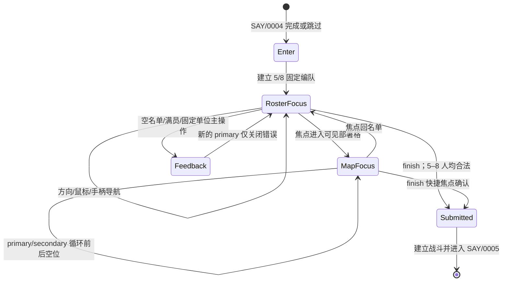

# 第 1 关部署 UI 状态与低保真构图

版本：Draft 0.1

状态：M02 已授权；部署实现前 UI 合同

关联关卡：[`stage-01.md`](../vertical-slices/stage-01.md)

系统合同：[`deployment-stage1.md`](../systems/deployment-stage1.md)

低保真图：[`wireframes/stage-01-deployment.svg`](wireframes/stage-01-deployment.svg)

## 1. 目的

本文件只定义第 1 关关前剧情结束后的交互部署表面。它不改变固定/可选槽、三个
`FFh` 空位、最大八人、错误阻断或提交语义。部署合法性属于纯模拟；DOM 和 Phaser
分别投影名单与地图。

## 2. 视觉方向

- `[OF]` 保留原版 `640×350` 逻辑表面、三列五行名单、`Ⅰ/Ⅱ/Ⅲ` 页签、`結束` 和底部错误条。
- `[DD]` 地图继续铺满逻辑表面；DOM 名单以稀疏的原版热点构图浮在地图上，不建立
  覆盖整张战场的现代仪表盘。
- `[DD]` 名单按钮使用现有原版菜单的红橙棋盘纹理、银色选中横饰和像素边框；状态文字
  采用现有繁体 UI 字体和调色板，不使用通用白色卡片。
- `[DD]` 当前部署格同时显示黑白斜面轮廓与“下一落点”文字；固定/可选/已出场不能只靠颜色。
- `[DD]` 非必要动画只用于焦点和单位加入/撤下；减少动态时直接切换终态。

## 3. 逻辑表面

Phaser 负责：

- 当前 `10×7` 部署视口、地形、固定单位、已选可选单位；
- 三个剩余 `FFh` 格和当前 open cell 的像素轮廓；
- 视口/棋子投影，不处理加入、撤下、满员或固定单位错误。

DOM 负责：

- 三列五行名单、页签、`結束`；
- 人物名、职业、等级、生命、固定/可选/已出场状态；
- `已出場 5–8／8`、剩余空位和当前落点说明；
- 底部三条原文错误及屏幕阅读器反馈。

名单热点沿用原版构图基线：三列原点 X=`57/201/345`、五行 Y=`59/119/179/239/299`，
页签 X=`440`，完成 X=`540`。Web 可以扩大透明可点击/触摸命中区，但可见边框和焦点中心
必须保持在对应逻辑位置，不能遮住当前部署格。

## 4. 状态流

错误存在时，方向、次操作、名单动作、页签和完成全部被消费且状态不变；只有新的主操作
关闭错误。关闭错误的同一次输入不能继续加入、撤下或完成。

## 5. 焦点拓扑

- 三个名单列各自上下循环五行；左右移动进入相邻名单列。
- 第三名单列向右进入页签列；页签列上下循环三项。
- 页签列向右进入 `結束`；`結束` 向左回到当前页签。
- 地图 open cell 是同一语义焦点图中的 contextual 节点：鼠标点击直接进入；键盘/手柄
  从名单下方或明确的地图导航动作进入，离开时恢复先前名单焦点。
- 输入设备切换只改变焦点来源，不能提交部署动作。
- 地图状态中的 `secondary` 遵循原版，循环到后一处 open cell；不是取消。

## 6. 响应式与可访问性

- `640×350` 内部坐标不重排；窄屏只做整数优先的等比缩放和现有外层折叠。
- 触摸设备可放大透明命中区，但不得把名单改成纵向无限滚动或遮住整个战场。
- 每个名单按钮的无障碍名包含“人物、职业、等级、生命、固定/可选、已出场/未出场”。
- 当前 open cell 使用轮廓、位置文字和 `aria-live`，不能只使用高饱和颜色闪烁。
- 错误条使用 `role="alert"`；错误关闭前 DOM/Canvas 输入门保持一致。

## 7. 验收

1. 初态显示五名固定单位、三个空位、`5／8`，没有自动选中可选角色；
2. 同一 placements 通过鼠标、键盘、手柄得到相同单位、焦点、镜头和 PRNG；
3. 地图主/次操作按相反方向循环剩余 open cells，次操作不退出部署；
4. 三条错误均位于底条，只有新的主操作关闭且不穿透；
5. 五至七人可以完成，残余 open cells 在战斗投影中消失；
6. 桌面、窄屏和减少动态截图保持地图可读、名单不遮住当前 open cell。
