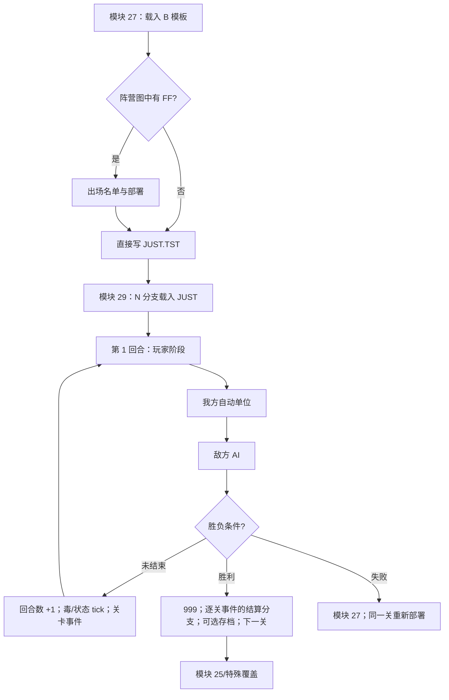

# 从部署到战后的单场战斗生命周期

日期：2026-07-15

## 结论

模块 23、27 与 29 已连接成一条完整、可复现的普通战斗状态机：标题新游戏写 `CONTINU='N'` 并进入模块 25/27，模块 27 载入逐关 `B.SWF` 模板，按 `FFh` 部署格决定是否显示出场界面，完成后生成 `JUST.TST`；继续游戏写 `CONTINU='0'..'4'` 并直接进入模块 29。模块 29 据此载入 `JUST` 或编号 `WAR`，执行“玩家 → 我方自动 → 敌方 AI”的完整回合，最后在胜利时进入下一场剧情/关卡，在失败时回到同关部署重试。

机器结果在 `reverse/parsed/native/battle-lifecycle.json`。导出器同时验证模块 27/29 的 22 段机器码、44 个模板、33 个交互部署入口和 423 个部署格。



## 模板中的部署数据

此前阵营/占用图的 `FFh` 只能确认会在小地图上画成白色标记。模块 27 的读写链现已把它提升为明确的业务语义：**尚未填入单位的玩家部署格**。

| 数据 | 原生位置 | 含义 |
| --- | --- | --- |
| 阵营图值 `0` | `B` 偏移 `1488h` 起 | 空格 |
| 阵营图值 `1/2` | 同上 | 双方已占用格 |
| 阵营图值 `FFh` | 同上 | 可填入的玩家部署格 |
| 75 个场景单位标志 | `B` 偏移 `20A4h`；模块 27 DS:`079E` | 非零时对应战役单位槽出现在出场名单；现有模板的非零值全部为 1 |
| 选中标志 | 模块 27 DS:`05A2` | 当前是否已出场 |
| 固定标志 | 模块 27 DS:`0638` | 模板初始已经位于 side 1 的单位；不可撤下 |
| 当前空部署格 | 模块 27 DS:`0FF6` | 下一名可选单位的落点；0 表示没有空位 |

`0000:0898` 扫描初始 side 1 格，把对应单位的“选中”和“固定”都置 1。`0000:08CB` 把 75 个非零场景标志转换成出场名单索引。`0000:1907/1884` 在 2,500 格阵营图中寻找 `FFh`，并循环定位下一个空位。

玩家选择名单项时，`0000:0D61` 的精确副作用为：

1. 当前名单位置没有人物指针：不改动部署状态，并显示“此處沒有人.”。
2. 未出场、名单有效且仍有 `FFh`：把当前格的阵营值改为 1，单位槽图写入该单位槽号，选中标志置 1，然后寻找下一处 `FFh`。
3. 已出场且不是初始固定单位：选中标志清零，找到该单位所在格，把阵营图和单位槽图都恢复成 `FFh`。
4. 已出场且是初始固定单位：拒绝撤下，并显示“此人必須出場戰鬥,不可放棄.”。
5. 没有剩余 `FFh`：拒绝新增，并显示“出場人數已滿.”。

三条错误都在屏幕底部即时绘制，不做逐字动画；清空输入后只接受一次新的主操作关闭，副操作无效且没有自动超时。完整底条几何、字形与关闭音效见 `error-and-outcome-presentations.md`。

按“結束”后，`0000:0CDE → 0FF8` 写出 `JUST.TST`。没有填满的 `FFh` 也会先被保存；模块 29 的 `1000:543B` 在新战斗载入后统一把残余 `FFh` 清成普通空格。因此复刻不能把所有白色部署格预先当成已出场单位，也不能让未填格留在正式战斗的阵营图中。

44 个模板按内部场景号统计：

- 33 个交互部署入口：`1,4,5,6,7,9,10,12–20,22–29,31–34,36–38,40,41`。
- 11 个直接生成 `JUST` 的入口：`0,2,3,8,11,21,30,35,39,42,43`。
- 交互入口共有 423 个 `FFh` 格。

以内部场景 1 为例：名单槽为 `0,1,2,4,24,40,41,42,43`，其中 `0,40,41,42,43` 已固定出场；地图有三处空位 `(21,33)/(23,33)/(25,33)`，所以四名可选后备中最多再上三人，总出场上限 8。

## `JUST` 与 `WAR` 的开战分支

模块 29 `0000:4BD9` 读取 DS:`0002`；该字段已绑定到 GO 原符号 `CONTINU`：

- 值为字符 `N`：调用 `1000:5386` 载入模块 27 刚生成的 `JUST.TST`。
- 其他值：作为编号槽选择进入 `1000:0DD0`，载入 `WAR*.TST`。

新战斗完成地图、单位和界面初始化后调用 `0000:4DCD`，所以玩家看到的首个正式完整回合是回合 1。编号存档则走 `1000:3788` 恢复存档阶段/显示状态，不额外开启一个新回合。

`JUST` 只保存开战所需的模板态；`WAR` 还保存回合数、战中单位状态、视口和其余可变态。两者不能在 Web 版中合并成一个含义模糊的存档结构。

正常战役还会在模块 27 准备模板时先执行 side-1 具名士兵经验修正。`0000:0493` 仅在 DS:`0028h` 不等于无父接口的独立运行哨兵 `4Eh` 时遍历 58 个导入槽：职业记录 0、角色描述符肖像不是 `FFh` 且经验不高于 299 的单位被写为 299。第 0 关的槽 0 妮雅和槽 1 希蜜满足条件；槽 40–43 的通用描述符以 `FFh` 触发职业视觉回退，故保持 0 经验。

模块 29 在开始首回合前再执行敌方难度属性初始化。除场景 3、8、11 外，`0000:4ABE` 重复 `LV_HARD+1` 次调用 `0000:538B`；每次由 `0000:539B` 把 side 2 活动单位经验写为下一累计阈值加 1。随后 `0000:536B/537B` 通过 `540D` 重建双方并回满生命，`LV_HARD==3` 的 side 2 加半发生在重建链末端。因此第 0 关妮雅/希蜜最终为 299 经验、等级 3、攻 45、防 27、生命 180；四名通用士兵为 0 经验、等级 1、攻 39、防 21、生命 160。编号 `WAR` 恢复不重复执行这些新战修正。

## 标准完整回合

`0000:48FE` 的普通循环顺序为：

1. 检查失败、胜利、场景 6 的额外胜利条件和场景 20 的生命阈值条件。
2. `1000:41BC` 判断 side 1 是否仍有可手动操作且未行动单位；有则继续玩家输入。
3. 手动单位耗尽后，`1000:1542` 处理剩余 side 1 自动/特殊单位。
4. `0000:4E03` 做阶段间显示与状态整理，`1000:147E` 清 side 1 行动位。
5. `1000:14A6` 执行 side 2 AI、场景 26 的阶段尾事件及敌方行动位复位。
6. 再次检查失败/胜利。
7. 尚未结束则调用 `0000:4DCD`：完整回合数加一，毒伤和八个状态槽各 tick 一次，执行逐关回合事件，然后回到玩家阶段。

这与 `turn-action-system.md`、`status-lifecycle.md` 的局部规则一致，并补齐了它们此前缺少的开战与终局边界。

## 胜利、存档与 `999/1000`

DS:`2F83` 平时是完整回合号，但同时复用两个终局哨兵：

| 值 | 含义 | 行为 |
| ---: | --- | --- |
| `1..` | 普通完整回合号 | 每次 `0000:4DCD` 加一 |
| `999` | 当前运行中的即时胜利 | 进入 `1000:42A8` 逐关事件分发器的结算分支；普通关显示存档询问 |
| `1000` | 从编号存档恢复的已完成胜利 | 再跑必要的逐关结算分支，但不重复显示存档询问 |

普通胜利先把 DS:`2F83` 置 999。`1000:42A8` 总是先写默认转移 `nextModule=25`、`nextStage=currentStage+1`，再依次调用所有逐关处理器，由特殊关覆盖。这个函数同时在 `0000:4DF5` 的回合边界调用，因此准确语义是“逐关战斗事件分发器”，不是只服务胜利的战后函数。普通关随后显示：

> 哦！．．｜這次的戰役結束了，是否要記錄下來．

反馈复用 `A/18` 上方对话窗；胜利读取 PIT 计时位，在 `D/45` 与 `D/46` 肖像之间选择。非标点 Big5 字符按编码模 15 请求 `MAGIC/57..71` 短声并等待播放，再等待 8 个原生 tick；主操作可快进剩余文字和声音。确认后打开五槽存档选择器并直接写入所选槽，没有覆盖二次确认。

若玩家确认保存，`1000:88B9` 在构造 `WAR` 元数据时把内存中的 999 转成序列化值 1000；它不把当前内存值改成 1000。以后载入这个存档，主循环看到 1000 会直接进入逐关事件的结算分支并跳过再次存档。Web 复刻若只保存一个布尔 `won`，会丢掉这一区分并容易产生重复结算。胜利、撤退、失败和退出共用表现器的完整时间线见 `error-and-outcome-presentations.md`。

普通胜利存档询问在内部场景 `21,37,38,42` 被主循环明确跳过，由这些场景的专用处理器负责流程。场景 21 直接进入场景 22 部署；场景 37 经内部场景 49、模块 33/35 转入场景 38 追加战；场景 38 在 999 播放 SAY 165 后转模块 46、在 1000 只恢复该跳转；场景 42 在 999 运行传送门表现并把下一场改为 6、在 1000 只恢复同一跳转。详见 `stage-events-and-campaign-routing.md`。

## 失败与同关重试

失败路径不会写 999，也不调用逐关事件的结算分支。`0000:0321 → 057F` 使用 `A/18` 窗口和 `D/46` 肖像显示：

> 啊！．．．竟然失敗了？｜我太低辜敵人的實力，再給我一次機會吧！

逐字规则与胜利相同。文字完成后清空主操作并无限等待一次新的主操作；副操作无效。随后写：

```text
nextModule = 27
nextStage  = currentStage
```

因此失败后的原生“重试”不是在当前战场内复活，也不是直接重载 `JUST`；它退出模块 29，重新进入模块 27，让玩家回到同关模板与部署流程。复刻时也应把“重试”建模成明确的状态转移，而不是 Phaser scene 内部随意 reset。

## 模块跳转例外

- 普通胜利默认进入模块 25、场景号加一。
- 模块 29 准备返回场景 6 时，会把实际下一模块强制改为 27；模块 27 为场景 6 准备完模板/部署并写出 `JUST` 后返回模块 25；模块 25 播放场景 6 的剧情记录 14，再直接返回模块 29。完整顺序是“部署 → 剧情 → 战斗”。
- 场景 42 胜利处理器把下一场改成 6，因而经过上述桥接；场景 21 则直接返回模块 27/场景 22，跳过模块 25 的场景 22 剧情。
- 场景 37 胜利把下一场覆盖为 49：模块 25 播放剧情 70 后进入模块 33；模块 33 预置模块 35，模块 35 再预置 `module27/stage38`。场景 38 是剧情明确标作“再次挑战”的追加战，胜利后进入模块 46；模块 46 运行制作人员表并进入永久终幕，调用后的 `module27/stage38` 写入不可达，不构成重玩路线。
- 战斗输入循环的 `Q` 已绑定“離開遊戲”确认：主循环把下一模块置 0 后退出；`Y` 已绑定“全面徹退”确认：返回模块 27、当前关卡重新部署。DS:`F6CDh/F6E0h` 分别是 J/数字键盘 `*` 的原始状态；只有发布版初始化为 `N` 且模块内无写入者的 DS:`132Fh` 开发门被外部改开后，Caps+J 才写胜利 999，Caps+`*` 才直接转模块 33。二者均不属于普通胜负状态机或正常玩家功能。

## Web 版实现边界

生命周期给出实现中不可混淆的三层：

- 模拟层拥有：模板、部署格/名单、单位与阵营图、回合/阶段、目标、`999/1000` 和下一模块/关卡。
- 表现层拥有：出场名单绘制、战场/HUD、对话、动画和音频；只能消费模拟事件，不能自行决定胜负。
- 持久化层保存可序列化模拟状态；新战模板和战中存档要保留 `JUST/WAR` 的角色差异。

## 可重复导出

```sh
node reverse/tools/angel2-battle-templates.mjs --extract \
  reverse/decoded/B \
  reverse/parsed/native/battle-templates.json \
  reverse/parsed/native/unit-descriptors.json
node reverse/tools/angel2-battle-lifecycle.mjs --extract \
  reverse/unpacked/lzexe-modules/raw/0027-unpacked.bin \
  reverse/unpacked/lzexe-modules/raw/0029-unpacked.bin \
  reverse/parsed/native/battle-templates.json \
  reverse/parsed/native/battle-lifecycle.json
```

## 仍待继续

1. 38/38 个逐关处理器的触发条件、SAY、直接棋盘/状态写入与结算跳转已闭合；场景 30 也已闭合为按 `LV_HARD` 长度推进的确定性多职业序列。九个特殊场景的逐操作音画时间轴见 `stage-event-presentations.md`，不再影响普通单场生命周期。
2. 玩家输入循环的 `Q/Y` 已分别绑定离开游戏和主动撤退；发布版关闭的 Caps+J/数字键盘 `*` 开发支路也已闭合并从正常玩法中排除。
3. 部署的 19 个鼠标热区、五列键盘导航、分页和前后 `FFh` 循环、发布版 Set-1 实体键位及当前 Joymouse 12 项翻译均已闭合；少量外围表现时序另由专项继续取证。
4. 标题、新游戏、四项难度、五槽继续与进入模块 25/29 的上层状态机已闭合；标题前 Logo、滚动开场、两套标题素材、空闲重播和音频触发也已由独立表现专题闭合。
