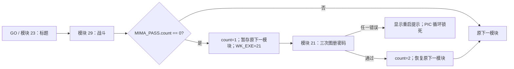

# 密码/图册验证流程

## 结论

密码界面不是启动标题前的固定入口。`GO.EXE` 仍以 `WK_EXE=23` 进入标题；模块 29 每次结束战斗模块时调用 `1000:06B9`，若 `MIMA_PASS.count==0`，便把原本的下一模块暂存到 `MIMA_PASS.savedNextModule`，把计数改为 1，并将下一模块替换成 21。模块 21 验证通过后把计数改为 2，再恢复此前暂存的下一模块。因此常规新游戏是在本次进程第一次离开战斗模块 29 后出现密码门；继续游戏则在本次进程第一次从载入的战斗退出时出现。



`MIMA_PASS` 位于 `146A:0312`，本链只消费前两个 word：`+0` 是进程内门计数，`+2` 是暂存的下一模块。`FM_DATA` 父块相对偏移 `1Eh` 保存指向它的 `0312h` 指针。`MIMA_NUM` 位于 `146A:0068`、初值 0，但在已闭合的模块 29→21 交接链中没有消费者，不能把它与挑战编号强行等同。

模块 29 主函数在密码辅助函数之后还有原生特例：若下一场景为 6，就强制导出模块 27。若这一条件恰好发生在本进程第一次退出模块 29，模块 21 的替换值可能被覆盖，而计数已留在 1；这是保留在机器状态图中的原版控制流边界。普通新战的第一次退出不走该边界。

## 三次挑战

模块 21 `0000:0502` 的可见流程为：

1. 显示“請輸入密碼”。
2. 连续生成三次挑战；三次回答分别写入 DOS 中断向量 0、1、3。
3. 显示“你已經輸入三次密碼，”和“你確定三次輸入的密碼都正確嗎？”。
4. 选择“重新輸入”会清屏并重做整组三次；选择“    確定”才读取三条向量并校验。
5. 任一答案不符即显示“密碼輸入錯誤,”、“請從新開機後,再試一次.”，随后在 `0000:0793` 反复重编程 8259 PIC，不再返回主流程。

每个回答并非写普通数组，而是用 DOS `INT 21h/AH=25h` 编入一条中断向量：向量 offset 是挑战号 `0..27`，segment 是用户选择的答案 `0..5`。确认时用 `AH=35h` 读回向量；验证器按 `DS:02CA + offset×6` 取预期 segment 比较。三个尝试依次使用向量 `0/1/3`。

未被启动器修改时，挑战选择器 `0000:0BEB` 从 PIT channel 0 的 `40h` 端口读取一个字节，并反复减 28，等价于：

```text
challenge = (previousChallenge + PIT.lowByte) mod 28
```

答案区不是数字按钮，而是六个 `80×38` 的彩色图像按钮。它们从左到右位于 X=`500`、Y=`60/106/152/198/244/290`；原生默认项是最左的蓝色按钮。可见图像、内部答案码与 `C/0032` 图像记录的对应关系如下：

| 顺序 | 可见主色（中心 RGB） | 内部答案码 | `C/0032` 图像记录 |
| ---: | --- | ---: | ---: |
| 0（默认） | 蓝 `(0,0,166)` | 2 | 4 |
| 1 | 绿 `(40,130,0)` | 1 | 3 |
| 2 | 橙 `(255,190,105)` | 0 | 2 |
| 3 | 棕 `(162,117,81)` | 3 | 5 |
| 4 | 紫 `(186,97,255)` | 4 | 6 |
| 5 | 白 `(255,255,255)` | 5 | 7 |

所以程序内部顺序仍是 `2、1、0、3、4、5`，图像记录顺序是 `4、3、2、5、6、7`，但这些数字都不是玩家可见标签。此前将内部码写成“界面显示数字”的描述已撤销。

## 图册与答案表

`C/0032` 是实际装入的完整密码界面资源。图册主画面已确认合成预览为 [`C/0032/01.png`](../renders/planar/C/0032/01.png)，尺寸 `432×340`；记录 `2..7` 是上表六个彩色按钮，记录 `20..23` 是定位圆圈时循环使用的手形标记帧。画面上的 28 个圆形位置与原生 28×6 字节表逐项一致；每条为 `{x, y, expectedAnswerCode}`。

原生代码每次从 28 个坐标中选一个，以手形动画标记对应圆圈，再等待玩家选择一个颜色按钮。结合“图册复制保护”的用途，纸质参照资料应提供圆圈与颜色的对应关系；这是界面语义推断。代码层已经确定的事实是坐标、六个可见色块、内部色码以及下表答案，不依赖纸质资料也足以复现和测试。

| 答案 | 挑战号 | 坐标 `(x,y)` |
| ---: | --- | --- |
| 0 | 0–5 | `(344,120) (408,288) (272,128) (224,32) (160,272) (40,240)` |
| 1 | 6–11 | `(56,48) (120,152) (352,280) (392,96) (272,32) (72,248)` |
| 2 | 12–16 | `(104,104) (176,32) (112,216) (288,216) (360,240)` |
| 3 | 17–21 | `(40,160) (192,160) (168,184) (368,40) (416,248)` |
| 4 | 22–23 | `(64,112) (416,128)` |
| 5 | 24–27 | `(264,296) (152,48) (184,208) (248,88)` |

模块数据中还保留 NUL 字符串 `MIMA_C.PCX`，但它在模块 21 中没有代码引用，原始目录也没有该文件；它更像打包前的开发源文件名。运行时实际读取的是索引资源 `C/0032`，不能把缺失 PCX 误列为资源提取缺口。

## `PLAY.COM` 的固定挑战补丁

参考目录建议通过 `PLAY.COM` 启动。这个 268 字节程序先挂接 INT `21h`，再执行 `GO.EXE`。它只有一条搜索替换规则：当被中断程序的 `CS:0BEB` 等于模块 21 原始八字节时，立即改写同一地址。

```text
原始  33 C0 E4 40 01 06 12 02   ; AX=0; AL=in(40h); [0212]+=AX
替换  B9 10 00 90 89 0E 12 02   ; CX=16; NOP; [0212]=CX
```

模块 21 在 `0000:000C` 就会调用 INT `21h`，早于密码界面，所以补丁会在第一次挑战前生效。结果是三次挑战都固定为 16；挑战 16 的原生答案码是 2，而答案码 2 正是默认最左的蓝色按钮。因而从 `PLAY.COM` 启动时，保持默认蓝色项并确认三次即可通过。直接运行 `GO.EXE` 不安装该钩子，仍使用 PIT 派生的 28 项挑战。

`PLAY.COM` 返回后会恢复原 INT `21h` 向量。该补丁是参考发行文件本身的一部分，不是本次逆向工具对原程序的修改。

## 直接资源与剩余边界

模块 21 直接读取八项索引资源：`A/0001`、`C/0032`、`E/0062`、`MAGIC/0081`、`MAGIC/0084`、`MUSIC/0000`、`UN/0041`、`UN/0042`。其中 `UN/0041` 是 29 个 Big5 双字节码加 `0000`，`UN/0042` 是 29 个 `16×15×1bpp` 字形，顺序与所有可见提示逐字对应。

模块在显示提示前还会用同一个向量读取/比较器检查原 DOS/BIOS 的中断向量 0、1、3。这部分依赖具体 DOS 环境，兼具反调试/保护作用；其正常可见结果已知，但尚未把每种 DOS/BIOS 初始向量映射成可移植规则。Web 复刻只需复现三次图册问答、重输、成功交接和失败锁死的可见语义，不应模拟全局 IVT/PIC 副作用。

完整答案、哈希、资源和状态机位于 [`password-flow.json`](../parsed/native/password-flow.json)，可由下列命令重新生成：

```sh
node reverse/tools/angel2-password-flow.mjs --extract \
  ref/ANGEL2/GO.EXE ref/ANGEL2/PLAY.COM \
  reverse/unpacked/lzexe-modules/raw/0021-unpacked.bin \
  reverse/unpacked/lzexe-modules/raw/0029-unpacked.bin \
  reverse/extracted reverse/parsed/native/password-flow.json
```
