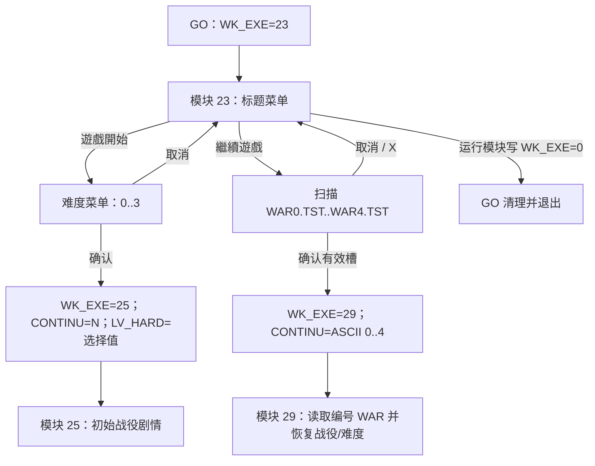

# 标题、新游戏与继续游戏原生流程

状态：原生状态机、可见选项、默认光标、指针热区、难度值、编号存档入口、直接资源记录，以及标题前 Logo、滚动开场、标题/难度/继续界面的表现时间轴均已闭合。状态机规格见 `reverse/parsed/native/title-flow.json`，表现规格见 `reverse/parsed/native/title-presentations.json`。

## GO 外层循环

`GO.EXE` 初始化 `WK_EXE=23`，随后重复装载并执行 `WK_EXE` 指定的运行模块；模块把下一状态写回共享父块。`WK_EXE=0` 时，GO 释放资源并退出 DOS。与标题流程直接相关的共享字段为：

密码模块 21 不位于标题之前。模块 29 在本进程第一次战斗模块出站时才通过 `MIMA_PASS` 暂存原目标并改走 21；通过后恢复原目标。完整交接与 28 项图册答案见 [`password-gate.md`](password-gate.md)，因此本文件的标题→模块 29 边仍然正确，只是模块 29 的首次出站多了一次密码门。

| GO 地址 | 符号 | 标题流程语义 |
|---|---|---|
| `146A:004A` | `WK_EXE` | 下一运行模块；初值 23 |
| `146A:005A` | `CONTINU` | `N` 表示新游戏/`JUST.TST` 路径；ASCII `0..4` 表示 `WAR0.TST..WAR4.TST` |
| `146A:0064` | `LV_HARD` | 确认后的难度值 0–3；进入标题前的哨兵初值为 `N` |



## 标题菜单

模块 23 `0000:0480` 驱动标题主循环，`0000:19F2` 以选项 0 为默认光标。可见选项和指针热区为：

| 值 | 标签 | 热区 `(x,y,w,h)` | 默认 |
|---:|---|---|---|
| 0 | 遊戲開始 | `(504,75,96,20)` | 是 |
| 1 | 繼續遊戲 | `(504,99,96,20)` | 否 |

键盘导航在 0 与 1 之间循环；指针悬停会更新当前项，主确认输入提交当前热区。标题每次未提交循环固定等待 8 个 native tick，指针移动会清零计数；连续 201 个未变化循环，即 1,608 个显式 tick 后，会翻转两套标题素材的标志、停止 `MUSIC/1`、淡出并跳回 `0000:0483h`。它会跳过标题前 Logo，重播完整滚动开场，再组装另一套标题画面，不是简单重绘。

## 新游戏与难度

选择“遊戲開始”进入 `0000:059F`。默认值为 0，键盘在 0–3 间循环，取消返回标题；`0000:1BD3` 在确认时把值写到模块 23 `DS:0000`，随后导出到 `LV_HARD`。

| 值 | 原版标签 | 热区 `(x,y,w,h)` | 场景 30 职业形态数 | 额外敌方强化 |
|---:|---|---|---:|---|
| 0 | 過關斬將 | `(504,51,96,20)` | 8 | 无 |
| 1 | 勢均力敵 | `(504,75,96,20)` | 16 | 无 |
| 2 | 困難重重 | `(504,99,96,20)` | 24 | 无 |
| 3 | 無法無天 | `(504,123,96,20)` | 32 | 全部 side 2 攻击、防御、最大生命各增加 `floor(原值/2)` |

确认后模块 23 写出 `WK_EXE=25`、`CONTINU='N'` 和所选 `LV_HARD`，初始战役场景仍为 0。四个标签也由存档槽界面使用的第二份指针表逐字确认，不是仅凭攻略名称推定。

## 继续游戏

`0000:1455` 建立五槽选择器，`0000:3C70` 依次尝试 `WAR0.TST` 至 `WAR4.TST`，每个文件先读 50 字节头部。原生标题是“讀取遊戲進度”，表头原文是“職業/等級/經驗值/儲存次數/難度”；五列依次读取 `12h/14h/16h/18h/1Eh`。首列把两字节 ASCII 职业码查表成职业名，中间三列右对齐显示十进制数，末列用四项难度标签。缺失文件的五组显示数组均填 `5858h`。

列的横坐标依次为 `96/160/216/288/336`。保存端在写元数据前只刷新 side 1 槽 0 的累计经验，不重新计算已有的职业/等级工作字段，因此发布版允许“職業/等級来自先前工作单位、經驗值来自 side 1 槽 0”的快照不一致。完整来源与五样本见 [`save-slot-format.md`](save-slot-format.md)。

五个热区均为 `x=90,w=316,h=24`，`y` 依次是 `100,130,160,190,220`，值为 0–4。默认槽为 0，键盘循环 0–4。空槽可以高亮但不能确认；确认有效槽返回 ASCII `0..4`，取消返回 ASCII `X` 并重启标题菜单。有效槽最终写出 `WK_EXE=29` 与对应 `CONTINU` 字符，模块 29 再从编号 WAR 文件恢复完整战役与难度状态。

## 标题资源绑定

资源索引由 GO 的启动资源表和原生读取调用交叉确认：`0=A`、`8=MUSIC`、`9=NUM`、`11=BK`、`13=UN`。

| 消费者 | 直接读取记录 | 已解码角色 |
|---|---|---|
| 模块 23 入口 | `A/23`, `A/24` | 228 项 Big5 码表与 228 个 `16×15`、每字 30 字节的位图字形一一配对 |
| `0000:0CE2` | `UN/53` | 标题前 Softstar Logo；无归档音频 |
| `0000:1034` | `MUSIC/14`, `BK/41`, `A/25` | 滚动开场音乐、初始背景与文字字形条；发布版控制表再读取 `BK/43..48` |
| `0000:12E4` | `BK/42` | 背景选择器 `#2` 的代码支持分支；发布版控制表没有 `#2`，数据不可达 |
| `0000:0611` | `BK/40`, `BK/57`, `BK/51`, `MUSIC/1`, `BK/56` | 标题菜单五流包、静态层、底图、音乐和 70 帧空闲素材；`BK/40` 不是占位记录 |
| `0000:07A3/07CF` | `BK/52..55` | 两套上部人物图与下部 Logo，由空闲重播标志切换 |
| `0000:1455` | `A/6` | 继续槽界面构造图形，使用图像 `0/1/5` |

`A/23` 以单个 `0000` 终止，字符数与 `A/24` 的 30 字节块数均为 228。标题和难度标签中的每个字符都能在该配对表中找到。

旧版专题曾把模块 23 中 `BX=8` 读取的两个记录误写为 `NUM/1` 和 `NUM/14`。GO 资源表确认 `8=MUSIC、9=NUM`，并且两个记录紧接着交给 RIX 驱动；正确绑定是 `MUSIC/1` 和 `MUSIC/14`。完整淡入、揭示、滚动、翻页、空闲重播、音频起止点和继续界面构造见 [`title-presentations.md`](title-presentations.md)。

## 可重复验证

```sh
node reverse/tools/angel2-title-flow.mjs --extract \
  ref/ANGEL2/GO.EXE \
  reverse/unpacked/lzexe-modules/raw/0023-unpacked.bin \
  reverse/extracted/A/0023.bin \
  reverse/extracted/A/0024.bin \
  reverse/parsed/native/title-flow.json

node reverse/tools/angel2-title-presentations.mjs --extract \
  reverse/unpacked/lzexe-modules/raw/0023-unpacked.bin \
  reverse/converted/audio/manifest.json reverse/decoded \
  reverse/renders/title-presentations \
  reverse/parsed/native/title-presentations.json
```

状态机提取器核验 25 段原生代码/数据 SHA-256 签名，并断言两个标题项、四个难度标签、五个继续槽、23 个直接资源记录和 228 项字形映射。表现提取器另核验 31 段代码、5 段数据、19 个图形记录、2 段 RIX、97 张调色板正确图像与 4 张联系图。native tick 已闭合为标称 10.000151 ms；仍保留 VGA retrace 宿主时长、低层绘图原语原设计名及主机音频漂移，不影响原版顺序和同步边界。
