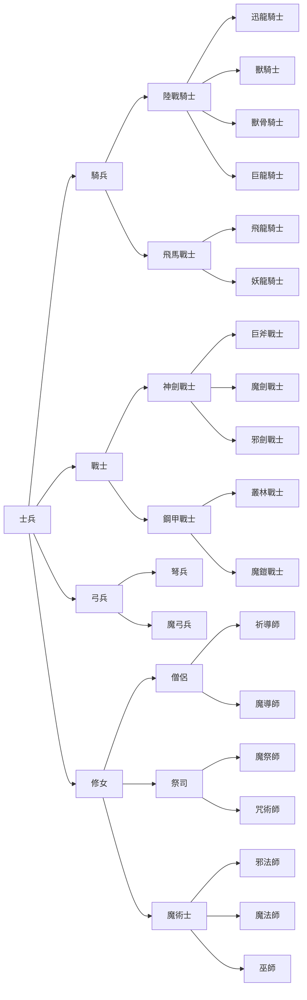

# 《天使帝国 II》兵种数值与转职表验证

日期：2026-07-15

## 结论

`ref/修改.txt` 不是原版设计表，而是由同一版 `DATA.SWF` 制作的修改攻略。它不能覆盖原始数值：其 `field0`（经验阈值）已被作者统一除以 50，文末还有一行不属于原文件的附加零记录。模块 29 的原生描述符进一步证明其名称表也有八处差异，其中四处是“帥/師”，四处是实质错名。

本轮只把被证据支持的结论写入 GDD；未修改任何原始文件，也未开始 Web/Phaser 实现。

为避免后续从多份中间文件手工拼接，现已生成一份 39 记录权威目录：

- `reverse/parsed/native/unit-catalog.json`：保留完整五行原版数值、side 1/2 短码、AI 职业分派、玩家行动类型、转职入边/出边、击倒奖励、第三行后成长、普通攻击附加状态、射击/技术菜单以及 `MAP` profile 引用。
- `reverse/parsed/native/unit-catalog.csv`：面向人工审阅和表格导入的扁平版本；其中经验阈值始终取原版 `DATA.SWF`，不会误用攻略除以 50 后的值。

目录生成器会把关键交叉检查作为硬断言：39/39 原生名称、195/195 经验变换、1,170/1,170 其他字段、31/31 转职边、12/12 候选顺序、39/39 AI 短码分派以及 39/39 两类 `MAP` profile 覆盖。任何上游提取结果发生不一致时，目录不会生成。

## 输入、哈希与复现

- 原始表：`ref/ANGEL2/DATA.SWF`，2,730 字节，SHA-256 `3b0a1430b423a9c1d7c5f91dddb2928992c170df39698e71da78df940e8b05b9`。
- 外部资料：`ref/修改.txt`，15,327 字节，SHA-256 `0f53c5a21ad8e495da8ebb9e926227419a5eae161661397333d0b362778c70be`。
- 外部资料角色：`untrusted_external_modification_guide`；只用于提出可检验的名称、字段和转职关系。
- 比对工具：`reverse/tools/angel2-unit-guide.mjs`。

```sh
node reverse/tools/angel2-unit-guide.mjs --compare \
  ref/修改.txt \
  reverse/parsed/tables/DATA.json \
  reverse/parsed/external/unit-guide-comparison.json
reverse/tools/angel2-unit-descriptors.mjs --extract \
  reverse/unpacked/lzexe-modules/raw/0029-unpacked.bin \
  reverse/parsed/native/unit-descriptors.json \
  reverse/parsed/external/unit-guide-comparison.json
reverse/tools/angel2-unit-catalog.mjs --build \
  reverse/parsed/tables/DATA.json \
  reverse/parsed/native/unit-descriptors.json \
  reverse/parsed/native/promotion-table.json \
  reverse/parsed/native/map-rules.json \
  reverse/parsed/native/combat-formulas.json \
  reverse/parsed/native/technique-rules.json \
  reverse/parsed/native/ai-rules.json \
  reverse/parsed/external/unit-guide-comparison.json \
  reverse/parsed/native/unit-catalog.json \
  reverse/parsed/native/unit-catalog.csv
```

## 逐值比对结果

原文件的结构是 `39 records × 5 rows × 7 little-endian u16`，即每条 70 字节。修改攻略所称“七 bytes”不准确；它列出的每个数均占两个字节，十六进制栏展示的是文件字节顺序，例如十进制 39 对应 `27 00`，写作 `2700`。

| 字段 | 攻略标签 | 与原版逐值比对 | 当前等级 |
| --- | --- | --- | --- |
| `field0` | 经验 | 195/195 满足 `攻略值 = floor(原版值 / 50)`；只有原值为 0 等情况仍表面相等 | 数值变造 C；经验阈值 C |
| `field1` | 攻击 | 195/195 与原版完全相同 | C |
| `field2` | 防守 | 195/195 与原版完全相同 | C |
| `field3` | 生命 | 195/195 与原版完全相同 | C |
| `field4` | 移动 | 195/195 与原版完全相同 | C |
| `field5` | `????` | 195/195 与原版完全相同；两套原生战斗属性应用器均跳过，但全表 I/O/数值显示保留 | C（运行时行为）/U（设计意图） |
| `field6` | 等级 | 195/195 与原版完全相同 | C |

攻略自身的十进制栏与存储字节栏 196 行×7 项全部一致。字段名称还得到原版界面字符表中的“生命、攻击、防禦、等級、經驗、職業”以及多份独立攻略数值的交叉支持。LZEXE 二次解包后，模块 29 的 `5256h/52BCh` 与模块 33 的 `09DCh/0B6Ah` 独立确认相同的字段访问，并都跳过 `field5`。因此 `field5` 的原版运行时处理已确认，但原始设计意图仍未知。AI 决策使用的逐槽行为值来自另一张战斗状态表 DS:`3BF6h`，并由 `1000:2300` 复制；它不是这个 `field5`。详情见 `native-unit-table-access.md` 与 `ai-decision-system.md`。

## 妖龍騎士与魔鎧戰士的“攻防交换”核查

攻略中“妖龍騎士牺牲防御换攻击、魔鎧戰士牺牲攻击换防御”的说法没有对应的原生战斗分支。`DATA.SWF` 的实际前三行（攻击／防御）为：

| 职业 | L10 | L11 | L12 | 第三行后成长 |
| --- | ---: | ---: | ---: | --- |
| 妖龍騎士 `1F` | `87/45` | `93/48` | `99/51` | 攻击 `+3`、生命 `+20`，防御不增长 |
| 魔鎧戰士 `1H` | `76/60` | `78/72` | `80/84` | 攻击 `+1`、生命 `+25`，防御不增长 |

转职前的飛馬戰士 L9 为 `80/42`，转为妖龍后攻防均增加；同路线飛龍騎士 L10 为 `92/44`，比妖龍 L10 的攻击更高、防御更低，因此“妖龍牺牲防御换攻击”连同路线静态对比也不成立。鋼甲戰士 L9 为 `72/55`，转为魔鎧后攻防均增加；魔鎧到 L12 的 `80/84` 确实形成低攻高防取向，但它仍是静态数据。模块 29 `5256h/52BCh` 与模块 33 `09DCh/0B6Ah` 的属性应用路径只装入攻击、防御、生命、移动和等级，跳过 `field5`；第三行后成长消费者 `1000:8E5Bh..8E85h` 只增加攻击与最大生命。两职业短码在普通攻击、射击、技术、玩家菜单和 AI 分发中也没有独立消费者。因此两句攻略说法都不能在复刻中实现为战斗时扣除一项再增加另一项。

### 2026-08-16 全模块穷举复核

上述否定结论已由一次独立的全模块扫描复核，并补充三条此前未覆盖的通道。扫描对
`lzexe-modules`／`runtime-modules`／`JS3.UNPACKED.EXE` 的每个模块，按全部 39 个职业短码
逐一搜索，并用完整 8086 立即数操作数分类器识别 `cmp/mov/add/sub/or/and` 等所有可能编码，
而不是裸字节匹配。七项已知的普通攻击链职业特性 7/7 阳性对照全部命中，方法灵敏度成立：

| 职业 | 短码 | 特性 | 地址 |
| --- | --- | --- | --- |
| 巨斧戰士 | `0G` | 压制反击 | `0000:92C5`、`0000:A1A7` |
| 獸骨騎士 | `2E` | 反击伤害升为先攻全额 | `0000:9543` |
| 水戰士 | `0N` | 受击分裂 | `0000:932D` |
| 邪劍／叢林／魔劍／獸騎 | `2G/0H/1G/1E` | 普通攻击附加状态 | `0000:92EE/92F3/92F8/92FD` |

`1F/1H` 的全部立即数命中只有三类，均无特殊性：`0000:6770..67CD` 与 `1000:16BC..1723`
两条全近战派发链同落 `0000:6849`／`1000:18A1`；`1000:8D94` 属**技能码命名空间**；模块
0025/0037 的 4 字节分组指针表与同线队友共用同一指针。补充的三条通道为：

1. **记录号通道**：职业记录号位于 DS:`318Ch`，全模块 `cmp word [318Ch], imm` 命中数为 0，
   5 处读取全部只作查表索引，故不存在按记录号写死的分支。
2. **有效攻防计算点**：`0000:52BC` 照抄 `DATA` 行；`1000:8BD1` 仅在难度 3 且 side 2 时各
   `+floor(x/2)`；`1000:8C2D..8C89` 只按状态位 ±20。整条链没有任何职业项，因此“动态攻防
   交换”是在计算点被排除的，而不只是由静态数据推断。
3. **地形防御 profile**：`1H` 与 `1G/2G/2E/0E/3E` 逐槽相同；`1F` 与飛龍騎士 `0F` 逐槽相同，
   属飞行档，数值约为地面系的一半（如槽 5 为 25 对 40）。这是真实机制差异，但属飞行分组的
   共享数据档，且只单向降低防御收益，不换取任何攻击。

复查时的两个陷阱：职业短码 `1F/1H` 与技能码 `1F`＝初級炎暴、`1H`＝初級治療 同形，
`1000:8D94` 的链是技能分发，不得误判为职业特性；裸字节搜索还会命中模块 0025/0037 的
4 字节数据表。静态扫描的唯一盲区是寄存器对寄存器的短码比较，但该形式只能比较两个动态
职业码（例如攻守是否同职业），无法编码写死的职业特性，不构成缺口。

补充的数值口径：魔鎧戰士的“低攻高防”取向在原版数值上成立但受限——它以 `+12`/行 的全表
最陡防御成长拿到 3 级防御 84（35 个常规记录的最高值），代价是战士线最低攻击与 4 阶近战
最低攻击步长 `+1/590`；由于防御在职业内 3 级后永久固定，该优势不随后期成长扩大。同层的
叢林戰士 `0H` 在 L10 时以 `78/64/450` 于攻、防、生命步长上全面压制魔鎧的 `76/60/450`，
魔鎧要到 L11 才靠防御反超。妖龍騎士的实际特征则是骑兵线第二高的攻击步长 `+3/540` 与
骑兵线最低的移动 9。

## 记录号与兵种名称

攻略按 `DATA.SWF` 的物理顺序列出 35 个名称；同一顺序下的数值全部逐值匹配，因此它曾足以建立 S 级候选映射。现由模块 29 两套原生描述符直接确认全部 39 个名称（两套 39/39 一致），并纠正攻略错误；以下表格以原生名称为准，等级提升为 C。

| 记录 | 名称 | 记录 | 名称 | 记录 | 名称 |
| ---: | --- | ---: | --- | ---: | --- |
| 0 | 士兵 | 1 | 魔劍戰士 | 2 | 叢林戰士 |
| 3 | 魔祭師 | 4 | 祈導師 | 5 | 咒術師 |
| 6 | 魔術士 | 7 | 巨斧戰士 | 8 | 半龍戰士 |
| 9 | 魔鎧戰士 | 10 | 魔導師 | 11 | 邪法師 |
| 12 | 魔弓兵 | 13 | 陸戰騎士 | 14 | 妖龍騎士 |
| 15 | 飛龍騎士 | 16 | 獸騎士 | 17 | 獸骨騎士 |
| 18 | 迅龍騎士 | 19 | 巨龍騎士 | 20 | 弓兵 |
| 21 | 弩兵 | 22 | 騎兵 | 23 | 飛馬戰士 |
| 24 | 修女 | 25 | 僧侶 | 26 | 水戰士 |
| 27 | 神劍戰士 | 28 | 戰士 | 29 | 鋼甲戰士 |
| 30 | 祭司 | 31 | 巫師 | 32 | 魔法師 |
| 33 | 邪劍戰士 | 34 | 工兵 | 35 | 女帝 |
| 36 | 龍 | 37 | 頭 | 38 | 手 |

原生差异共有八处：攻略将记录 4、5、10、31 的“師”写成“帥”；记录 3“魔祭司”应为“魔祭師”；记录 11“魔法帥”应为“邪法師”；记录 23“飛馬騎士”应为“飛馬戰士”；记录 32“邪法帥”应为“魔法師”。记录 11 与 32 实际被对调。完整描述符地址、Big5 原字节和两套短码见 `reverse/parsed/native/unit-descriptors.json` 与 `native-unit-table-access.md`。

两套描述符的角色也已确认。`0000:5087` 为 side 1/2 分别写入 DS:`31C9h=1/2`，`0000:5230` 据此选择 DS:`320Dh/325Dh`，所以 set1 是 side 1，set2 是 side 2，并非两套未绑定的外观候选。唯一差异仍是记录 29“鋼甲戰士”：side 1 短码 `1C`，side 2 短码 `0C`。后者与记录 27“神劍戰士”同码，故 side 2 钢甲会按 `0C` 进入职业分派和第三行后成长；但 `MAP.SWF` 的两类 profile 选择器始终取 set1/SI 的短码，移动与地形 profile 仍按 `1C`。这是原版内部不一致，忠实层不得把两边偷偷统一。

## 转职图

下图最初来自攻略末尾 ASCII 图，现已由模块 29 的原生候选表逐边确认。35 个源记录指针、`99` 哨兵与“目标记录+1”编码恢复出完全相同的 31 条边和每组候选顺序，因此整体等级为 C。



### `DATA` 第四行与运行时触发边界

- 31 条转职边中，30 条满足“来源职业 `DATA` 第四行 `field6` = 目标职业首行 `field6`”。生成器直接读取原版 `DATA.SWF` 并逐边断言这项表格关系，但模块 29 的普通战斗成长不读取第四／第五行，它不是转职触发条件。
- 唯一不对齐是 `弓兵(20) → 弩兵(21)`：弓兵第四行 `field6=7`，弩兵首行 `field6=8`；弩兵确实是候选 0，不是 ASCII 图抄错。
- 原生生产链证明提交与两侧 `field6` 无关：`029Ah` 对全部 2,500 个棋盘占用格的 side 1 单位统一调用 `02B7h`；资格函数只检查当前职业派生成长行、阵营和候选哨兵，随后唯一菜单/提交链 `045Bh → 0693h/0744h` 从不载入或比较目标职业首行。弓兵在派生第 4 成长行即可选择弩兵，提交后才以“新职业 + 经验 0”进入后续常规派生。
- `工兵`、`水戰士`、`半龍戰士` 没有出现在普通转职图中。发布模板给出了非转职来源：场景 13 将可部署的 side 1 槽 10/11 覆写为水戰士；场景 22 将可部署的 side 1 槽 25–31 覆写为半龍戰士；场景 27 固定加入 side 1 槽 56–58 的工兵。三者因此是场景职业覆写/固定实例，而非隐藏转职分支；槽位对应的角色姓名和叙事称谓没有在现存表中恢复。

### 原生候选表、触发与提交

模块 29 的 DS:`06C3h` 是 35 项转职指针表。每项指向六个 `u16`，按 `99` 截止；有效数值减一就是目标记录。原生提取器恢复出 12 个有候选的来源、23 个终端来源和 31 条有序边，机器比对结果 `edgeSetExact=true`、12/12 来源顺序完全相同。可重复提取：

```sh
reverse/tools/angel2-promotion-table.mjs --extract \
  reverse/unpacked/lzexe-modules/raw/0029-unpacked.bin \
  reverse/parsed/native/unit-descriptors.json \
  ref/ANGEL2/DATA.SWF \
  reverse/parsed/native/promotion-table.json \
  reverse/parsed/external/unit-guide-comparison.json
```

原生短码同时形成与边表一致的层级：

- `0A士兵 → 1A騎兵 / 2A戰士 / 3A弓兵 / 4A修女`。
- `1A → 0B陸戰騎士 / 1B飛馬戰士`；`2A → 0C神劍戰士 / 1C鋼甲戰士`；`3A → 0I弩兵 / 1I魔弓兵`；`4A → 0D僧侶 / 1D祭司 / 2D魔術士`。
- `0B → 0E/1E/2E/3E`，`1B → 0F/1F`，`0C → 0G/1G/2G`，`1C → 0H/1H`，`0D → 0J/1J`，`1D → 0K/1K`，`2D → 0L/1L/2L`；每一组都恰好是攻略所列的下一层职业。
- 非普通线另占 `0N/1N`（水戰士/半龍戰士）、`5A`（工兵）与 `0P`–`3P`（女帝/龍/頭/手）。

触发函数 `02B7h` 要求当前单位为玩家 side 1、成长/等级行计数大于 3，且当前职业首候选不是 `99`。`5256h` 先把前三个固定行计为 `1/2/3`，第三行后每跨过一次短码成长阈值再递增；因此 12 个可转职来源的真实触发经验都是“第三行阈值 +100”，不是各记录第四行的经验字段。双方短码都使用同一默认步长；鋼甲戰士虽为 side 1 `1C`／side 2 `0C`，两个短码仍同为默认 `+100／+1／+10`。全 code-segment direct-call 扫描确认 `02B7h` 只由棋盘扫描器 `029Ah` 调用，`09D8h`、`0693h`、`0744h` 也分别只有 `02CDh`、`0467h`、`0483h` 这一处生产调用；表现函数 `045Bh` 则只由 `02DAh` 写入回调槽 `07C3h`，再由 `0442h` 间接调用。完整链上没有角色槽或剧情关卡限制，也没有目标起始等级检查。

`0693h` 为每个候选建立菜单项；`0744h` 会循环到有效选择，没有取消返回分支，然后把候选减一写入玩家职业数组 `56DAh`。同一提交路径把单位状态结构 `+02h` 清零，而 `510Ch` 独立确认该偏移是当前经验，因此转职经验归零为 C。

转职菜单前的 `0487h` 已逐指令闭合。它把当前角色记录 DS:`3192h` 与 `002Eh`（妮雅）比较，并直接调用逐字渲染器 `08DDh`；该渲染器完成定时字形循环后返回，期间没有确认输入。妮雅分支只在上方窗口显示 `我的經驗值已達到轉職的目標，|應該選擇甚麼職業？`。其他队友先在下方窗口显示 `我的經驗值已達到轉職的目標，|請主將授我新的職業．`，随后切换妮雅到上方窗口回应 `現在我在水神「愛西斯」的面前，|授予妳新的職業．`；第一段下方窗口保持可见。`0487h` 在每次调用前直接写入文字光标：上窗为屏幕 `(180,30)`，相对 `A/18` 上窗 `(153,10)` 即 `(27,20)`；下窗为屏幕 `(140,270)`，相对下窗 `(97,250)` 即 `(43,20)`。三段原文、地址、换行、光标与两套有序序列已固化到 `promotion-table.json.runtimeEvidence.promotionDialogue`。

`0744h` 的完整提交函数没有第三项属性变更：它不写状态结构 `+00h`，所以当前生命保持原值；也不调用 `DATA` 行选择器，不在这个函数内重写攻击、防御、最大生命、移动或状态。紧接着的常规单位装载会按“新职业 + 零经验”重新派生职业属性，因此玩家可见结果确实是转职后属性更新，但不是转职治疗。Web 修正版可把提交与派生合成一个不可观察中间态的原子事务。

## 独立资料交叉检查

- [喵喵的家：天使帝國 2 攻略](https://vv0817.neocities.org/gametxt/04_eoa2) 给出的职业树与 31 条边整体一致。
- [天使帝國 2 兵系表](https://kmoybgg.pixnet.net/blog/posts/7040708472) 列出的士兵等职业原始攻击、防御、生命和移动值与 `DATA.SWF` 相符。
- [游戏年代：职业与兵种说明](https://gmerago.com/forum.php?mod=viewthread&tid=3663) 独立描述了职业路线，并指出弩兵/魔弓兵存在不同于多数高阶职业的等级安排。

这些网页只能提升外部结论的可信度，不能取代本地原程序证据。

## 普通成长补充结论

模块 29 已确认普通经验是保留的累计值：前三行按累计阈值选择，第三行后使用 23 项职业成长表或默认步长反复增加攻击和最大生命，不读取 `DATA` 第四、第五行；只有转职提交才把经验归零。完整公式见 `ordinary-combat-formulas.md`。

## 证据与兼容边界

1. 普通转职没有未进入当前提交路径的角色/剧情限制：全棋盘 side 1 扫描、唯一资格函数、唯一候选复制、菜单与提交调用链已闭合；弓兵第四行／弩兵首行 `field6` 的 7→8 表格不对齐不参与资格或提交。
2. `field5` 在复刻中应原样保留且不参与已知战斗属性应用；只有找到新的原生消费者才可赋予语义。
3. 场景 30 的确定性多职业序列、每次转换前的上下文短句与最终“女帝”加入玩家槽 23，场景 20/22 的“龍”激活，以及场景 37“頭 + 两只手”的独立生命/行动和四种专用效果公式均已闭合；特殊逐关音画见 `stage-event-presentations.md`。
